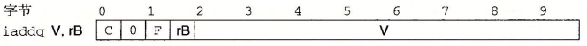

# Architecture Lab记录

<p style="text-align:right;">by TomatoEater<br>2021年10月</p>

Architecture Lab 一共有三个部分。第一个部分让你手写Y86-64汇编代码，并利用提供的assembler模拟器将.ys汇编成目标文件.yo。第二部分让你给顺序执行的处理器增加iaddq指令。第三部分是建立在前两者之上，我们既要手写Y86-64汇编来从算法上提高程序性能，还要修改处理器来使它执行这个程序更加快。

在开始之前，建议直接把Makefile中的GUIMODE、TKLIBS、TKINC三个全部注释掉，不使用GUI模式只用TTY模式。本人一开始也想要用GUI，于是下载了tcl、tk等工具，但是在编译的时候，发现tcl8.6会报错：`error: ‘Tcl_Interp’ has no member named ‘result’`。查了一下是tcl8.6相比tcl8.5把result给去掉了，使得编译不成功。准备下载tcl8.5，可是ubuntu20.04的包管理器似乎已经不提供tcl8.5了，要么去网上下载tcl8.5的deb文件再安装。但是嫌麻烦就不做了。

***


## 1. Part A

在seq/misc文件夹下，将三个C程序翻译成Y86-64汇编程序（*.ys）。利用提供的yas程序将.ys变成.yo目标文件（.yo这里是ASCII格式的，虽然严格意义上应该是二进制文件，但是这样才有可读性），再通过yis程序来模拟机器代码的运行，会输出内存和寄存器的变化。三个C程序分别是链表求和、递归链表求和以及拷贝内存地址，其中handout要求的sample list以及copy block分别为：

```assembly
# Sample linked list
.align 8
ele1:
    .quad 0x00a
    .quad ele2
ele2:
    .quad 0x0b0
    .quad ele3
ele3:
    .quad 0xc00
    .quad 0

.align 8
# Source block
src:
    .quad 0x00a
    .quad 0x0b0
    .quad 0xc00
# Destination block
dest:
    .quad 0x111
    .quad 0x222
    .quad 0x333
```

### 1.1 sum_list

链表求和。C程序如下：

```c
/* linked list element */
typedef struct ELE {
    long val;
    struct ELE *next;
} *list_ptr;

/* sum_list - Sum the elements of a linked list */
long sum_list(list_ptr ls)
{
    long val = 0;
    while (ls) {
	val += ls->val;
	ls = ls->next;
    }
    return val;
}
```

本人手写的汇编如下：

```assembly
# sum.ys
# Y86-64 for sum_list    
    .pos 0
    irmovq  stack, %rsp
    call    main
    halt


    .align 8
    ele1:
    .quad 0x00a
    .quad ele2
    ele2:
    .quad 0x0b0
    .quad ele3
    ele3:
    .quad 0xc00
    .quad 0


main:
    irmovq  ele1,%rdi
    call    sum_list
    ret


sum_list:
    irmovq  $0x0,%rax
    jmp     test
loop:
    mrmovq  0x0(%rdi),%r8
    addq    %r8,%rax
    mrmovq  0x8(%rdi),%rdi
test:
    andq    %rdi,%rdi
    jne     loop
    ret


    .pos 0x200
stack:

```

利用yas生成.yo程序：

```shell
❯ ./yas sum.ys
```

sum.yo如下：

```assembly
                            | # Y86-64 for sum_list      
0x000:                      |     .pos 0
0x000: 30f40002000000000000 |     irmovq  stack, %rsp
0x00a: 804800000000000000   |     call    main
0x013: 00                   |     halt
                            | 
                            | 
0x018:                      |     .align 8
0x018:                      |     ele1:
0x018: 0a00000000000000     |     .quad 0x00a
0x020: 2800000000000000     |     .quad ele2
0x028:                      |     ele2:
0x028: b000000000000000     |     .quad 0x0b0
0x030: 3800000000000000     |     .quad ele3
0x038:                      |     ele3:
0x038: 000c000000000000     |     .quad 0xc00
0x040: 0000000000000000     |     .quad 0
                            | 
                            | 
0x048:                      | main:
0x048: 30f71800000000000000 |     irmovq  ele1,%rdi
0x052: 805c00000000000000   |     call    sum_list
0x05b: 90                   |     ret
                            | 
                            | 
0x05c:                      | sum_list:
0x05c: 30f00000000000000000 |     irmovq  $0x0,%rax
0x066: 708500000000000000   |     jmp     test
0x06f:                      | loop:
0x06f: 50870000000000000000 |     mrmovq  0x0(%rdi),%r8
0x079: 6080                 |     addq    %r8,%rax
0x07b: 50770800000000000000 |     mrmovq  0x8(%rdi),%rdi
0x085:                      | test:
0x085: 6277                 |     andq    %rdi,%rdi
0x087: 746f00000000000000   |     jne     loop
0x090: 90                   |     ret
                            | 
                            | 
0x200:                      |     .pos 0x200
0x200:                      | stack:

```

利用yis查看结果：

```bash
❯ ./yis sum.yo
Stopped in 26 steps at PC = 0x13.  Status 'HLT', CC Z=1 S=0 O=0
Changes to registers:
%rax:   0x0000000000000000      0x0000000000000cba
%rsp:   0x0000000000000000      0x0000000000000200
%r8:    0x0000000000000000      0x0000000000000c00

Changes to memory:
0x01f0: 0x0000000000000000      0x000000000000005b
0x01f8: 0x0000000000000000      0x0000000000000013
```

可以看出返回值%rax为0xcba，没毛病！

### 1.2 rsum_list

递归版链表求和。c程序如下：

```c
/* linked list element */
typedef struct ELE {
    long val;
    struct ELE *next;
} *list_ptr;

/* rsum_list - Recursive version of sum_list */
long rsum_list(list_ptr ls)
{
    if (!ls)
	return 0;
    else {
	long val = ls->val;
	long rest = rsum_list(ls->next);
	return val + rest;
    }
}
```

本人手写的汇编如下：

```assembly
# rsum.ys
# Y86-64 for rsum_list
    .pos 0
    irmovq  stack, %rsp
    call main
    halt


    .align 8
    ele1:
    .quad 0x00a
    .quad ele2
    ele2:
    .quad 0x0b0
    .quad ele3
    ele3:
    .quad 0xc00
    .quad 0


main:
    irmovq  ele1, %rdi
    call    rsum_list
    ret


rsum_list:
    pushq   %r12
    irmovq  $0x0, %rax
    andq    %rdi, %rdi
    je      end
    mrmovq  0x0(%rdi), %r12
    mrmovq  0x8(%rdi), %rdi
    call    rsum_list
    addq    %r12, %rax
end:
    popq    %r12
    ret


    .pos 0x200
stack:

```

测试有：

```bash
❯ ./yas rsum.ys
❯ ./yis rsum.yo
Stopped in 42 steps at PC = 0x13.  Status 'HLT', CC Z=0 S=0 O=0
Changes to registers:
%rax:   0x0000000000000000      0x0000000000000cba
%rsp:   0x0000000000000000      0x0000000000000200

Changes to memory:
0x01b8: 0x0000000000000000      0x0000000000000c00
0x01c0: 0x0000000000000000      0x0000000000000090
0x01c8: 0x0000000000000000      0x00000000000000b0
0x01d0: 0x0000000000000000      0x0000000000000090
0x01d8: 0x0000000000000000      0x000000000000000a
0x01e0: 0x0000000000000000      0x0000000000000090
0x01f0: 0x0000000000000000      0x000000000000005b
0x01f8: 0x0000000000000000      0x0000000000000013
```

可以看出返回值%rax为0xcba，没毛病！

### 1.3 copy_block

把src地址上的内存拷贝到dest地址上，返回拷贝值的异或。c代码如下：

```c
/* copy_block - Copy src to dest and return xor checksum of src */
long copy_block(long *src, long *dest, long len)
{
    long result = 0;
    while (len > 0) {
	long val = *src++;
	*dest++ = val;
	result ^= val;
	len--;
    }
    return result;
}
```

本人写的汇编如下：

```assembly
# copy.ys
# Y86-64 for copy_block
    .pos 0
    irmovq stack, %rsp
    call main
    halt


    .align 8
# Source block
src:
    .quad 0x00a
    .quad 0x0b0
    .quad 0xc00
# Destination block
dest:
    .quad 0x111
    .quad 0x222
    .quad 0x333


main:
    irmovq  src, %rdi
    irmovq  dest, %rsi
    irmovq  $0x3, %rdx
    call    copy_block
    ret


copy_block:
    pushq   %r12
    pushq   %r13
    pushq   %r14
    irmovq  $0x1, %r12
    irmovq  $0x8, %r13
    irmovq  $0x0, %rax
    jmp     test
loop:
    mrmovq  0x0(%rdi), %r14
    addq    %r13, %rdi
    rmmovq  %r14, 0x0(%rsi)
    addq    %r13, %rsi
    xorq    %r14, %rax
    subq    %r12, %rdx
test:
    andq    %rdx, %rdx
    jg      loop
    popq    %r14
    popq    %r13
    popq    %r12
    ret
    

	.pos 0x100
stack:

```

测试有：

```bash
❯ ./yas copy.ys
❯ ./yis copy.yo
Stopped in 45 steps at PC = 0x13.  Status 'HLT', CC Z=1 S=0 O=0
Changes to registers:
%rax:   0x0000000000000000      0x0000000000000cba
%rsp:   0x0000000000000000      0x0000000000000100
%rsi:   0x0000000000000000      0x0000000000000048
%rdi:   0x0000000000000000      0x0000000000000030

Changes to memory:
0x0030: 0x0000000000000111      0x000000000000000a
0x0038: 0x0000000000000222      0x00000000000000b0
0x0040: 0x0000000000000333      0x0000000000000c00
0x00f0: 0x0000000000000000      0x000000000000006f
0x00f8: 0x0000000000000000      0x0000000000000013
```

可见返回值%rax没有问题，0x111、0x222、0x333也改成了0xa、0xb、0xc。没毛病！

***


## 2. Part B

在sim/seq文件夹中，修改seq-full.hcl文件，实现iaddq指令

### 2.1 初识

在书中Practice Problem 4.3找到iaddq指令，可见它是把一个八字节的常数V加到rB之中。




参考Figure 4.18的OPq和irmovq可以依葫芦画瓢得到iaddq在六个阶段的操作：

| Stage      |       iaddq V, rB        |
| ---------- | :----------------------: |
| Fetch      | icode:ifun <--- M~1~[PC] |
|            |  rA:rB <--- M~1~[PC+1]   |
|            |   valC <--- M~8~[PC+2]   |
|            |     valP <--- PC+10      |
| Decode     |     valB <--- R[rB]      |
| Execute    |  valE <--- valB + valC   |
| Memory     |                          |
| Write back |     R[rB] <--- valE      |
| PC update  |       PC <--- valP       |

### 2.2 修改seq.hcl

参考4.3.4节修改seq.hcl，增加iaddq有（只列出修改部分）：

```
################ Fetch Stage     ###################################

bool instr_valid = icode in 
	{ INOP, IHALT, IRRMOVQ, IIRMOVQ, IRMMOVQ, IMRMOVQ,
	       IOPQ, IJXX, ICALL, IRET, IPUSHQ, IPOPQ, IIADDQ }; # 加入IIADDQ

# Does fetched instruction require a regid byte?
bool need_regids =
	icode in { IRRMOVQ, IOPQ, IPUSHQ, IPOPQ, 
		     IIRMOVQ, IRMMOVQ, IMRMOVQ, IIADDQ }; # 加入IIADDQ

# Does fetched instruction require a constant word?
bool need_valC =
	icode in { IIRMOVQ, IRMMOVQ, IMRMOVQ, IJXX, ICALL, IIADDQ };  # 加入IIADDQ

################ Decode Stage    ###################################

## What register should be used as the B source?
word srcB = [
	icode in { IOPQ, IRMMOVQ, IMRMOVQ, IIADDQ } : rB; # 加入IIADDQ
	icode in { IPUSHQ, IPOPQ, ICALL, IRET } : RRSP;
	1 : RNONE;  # Don't need register
];

## What register should be used as the E destination?
word dstE = [
	icode in { IRRMOVQ } && Cnd : rB;
	icode in { IIRMOVQ, IOPQ, IIADDQ} : rB; # 加入IIADDQ
	icode in { IPUSHQ, IPOPQ, ICALL, IRET } : RRSP;
	1 : RNONE;  # Don't write any register
];


################ Execute Stage   ###################################

## Select input A to ALU
word aluA = [
	icode in { IRRMOVQ, IOPQ } : valA;
	icode in { IIRMOVQ, IRMMOVQ, IMRMOVQ, IIADDQ } : valC; # 加入IIADDQ
	icode in { ICALL, IPUSHQ } : -8;
	icode in { IRET, IPOPQ } : 8;
	# Other instructions don't need ALU
];

## Select input B to ALU
word aluB = [
	icode in { IRMMOVQ, IMRMOVQ, IOPQ, ICALL, 
		      IPUSHQ, IRET, IPOPQ, IIADDQ } : valB; # 加入IIADDQ
	icode in { IRRMOVQ, IIRMOVQ } : 0;
	# Other instructions don't need ALU
];

## Should the condition codes be updated?
bool set_cc = icode in { IOPQ, IIADDQ }; # 加入IIADDQ
```

### 2.3 测试

1. make一下

   ```bash
   ❯ make VERSION=full # 懒的话直接修改makefile把version从std改成full就好了
   # Building the seq-full.hcl version of SEQ
   ../misc/hcl2c -n seq-full.hcl <seq-full.hcl >seq-full.c
   gcc -Wall -O2  -I../misc  -o ssim \
           seq-full.c ssim.c ../misc/isa.c  -lm
   ```

2. 测试一个简单的Y86-64程序

   ```bash
   ❯ ./ssim -t ../y86-code/asumi.yo
   Y86-64 Processor: seq-full.hcl
   137 bytes of code read
   IF: Fetched irmovq at 0x0.  ra=----, rb=%rsp, valC = 0x100
   IF: Fetched call at 0xa.  ra=----, rb=----, valC = 0x38
   Wrote 0x13 to address 0xf8
   IF: Fetched irmovq at 0x38.  ra=----, rb=%rdi, valC = 0x18
   IF: Fetched irmovq at 0x42.  ra=----, rb=%rsi, valC = 0x4
   IF: Fetched call at 0x4c.  ra=----, rb=----, valC = 0x56
   Wrote 0x55 to address 0xf0
   IF: Fetched xorq at 0x56.  ra=%rax, rb=%rax, valC = 0x0
   IF: Fetched andq at 0x58.  ra=%rsi, rb=%rsi, valC = 0x0
   IF: Fetched jmp at 0x5a.  ra=----, rb=----, valC = 0x83
   IF: Fetched jne at 0x83.  ra=----, rb=----, valC = 0x63
   IF: Fetched mrmovq at 0x63.  ra=%r10, rb=%rdi, valC = 0x0
   IF: Fetched addq at 0x6d.  ra=%r10, rb=%rax, valC = 0x0
   IF: Fetched iaddq at 0x6f.  ra=----, rb=%rdi, valC = 0x8
   IF: Fetched iaddq at 0x79.  ra=----, rb=%rsi, valC = 0xffffffffffffffff
   IF: Fetched jne at 0x83.  ra=----, rb=----, valC = 0x63
   IF: Fetched mrmovq at 0x63.  ra=%r10, rb=%rdi, valC = 0x0
   IF: Fetched addq at 0x6d.  ra=%r10, rb=%rax, valC = 0x0
   IF: Fetched iaddq at 0x6f.  ra=----, rb=%rdi, valC = 0x8
   IF: Fetched iaddq at 0x79.  ra=----, rb=%rsi, valC = 0xffffffffffffffff
   IF: Fetched jne at 0x83.  ra=----, rb=----, valC = 0x63
   IF: Fetched mrmovq at 0x63.  ra=%r10, rb=%rdi, valC = 0x0
   IF: Fetched addq at 0x6d.  ra=%r10, rb=%rax, valC = 0x0
   IF: Fetched iaddq at 0x6f.  ra=----, rb=%rdi, valC = 0x8
   IF: Fetched iaddq at 0x79.  ra=----, rb=%rsi, valC = 0xffffffffffffffff
   IF: Fetched jne at 0x83.  ra=----, rb=----, valC = 0x63
   IF: Fetched mrmovq at 0x63.  ra=%r10, rb=%rdi, valC = 0x0
   IF: Fetched addq at 0x6d.  ra=%r10, rb=%rax, valC = 0x0
   IF: Fetched iaddq at 0x6f.  ra=----, rb=%rdi, valC = 0x8
   IF: Fetched iaddq at 0x79.  ra=----, rb=%rsi, valC = 0xffffffffffffffff
   IF: Fetched jne at 0x83.  ra=----, rb=----, valC = 0x63
   IF: Fetched ret at 0x8c.  ra=----, rb=----, valC = 0x0
   IF: Fetched ret at 0x55.  ra=----, rb=----, valC = 0x0
   IF: Fetched halt at 0x13.  ra=----, rb=----, valC = 0x0
   32 instructions executed
   Status = HLT
   Condition Codes: Z=1 S=0 O=0
   Changed Register State:
   %rax:   0x0000000000000000      0x0000abcdabcdabcd
   %rsp:   0x0000000000000000      0x0000000000000100
   %rdi:   0x0000000000000000      0x0000000000000038
   %r10:   0x0000000000000000      0x0000a000a000a000
   Changed Memory State:
   0x00f0: 0x0000000000000000      0x0000000000000055
   0x00f8: 0x0000000000000000      0x0000000000000013
   ISA Check Succeeds
   ```

3. 测试除了加法运算的操作

   ```bash
   ❯ (cd ../y86-code; make testssim)
   ../seq/ssim -t asum.yo > asum.seq
   ../seq/ssim -t asumr.yo > asumr.seq
   ../seq/ssim -t cjr.yo > cjr.seq
   ../seq/ssim -t j-cc.yo > j-cc.seq
   ../seq/ssim -t poptest.yo > poptest.seq
   ../seq/ssim -t pushquestion.yo > pushquestion.seq
   ../seq/ssim -t pushtest.yo > pushtest.seq
   ../seq/ssim -t prog1.yo > prog1.seq
   ../seq/ssim -t prog2.yo > prog2.seq
   ../seq/ssim -t prog3.yo > prog3.seq
   ../seq/ssim -t prog4.yo > prog4.seq
   ../seq/ssim -t prog5.yo > prog5.seq
   ../seq/ssim -t prog6.yo > prog6.seq
   ../seq/ssim -t prog7.yo > prog7.seq
   ../seq/ssim -t prog8.yo > prog8.seq
   ../seq/ssim -t ret-hazard.yo > ret-hazard.seq
   grep "ISA Check" *.seq
   asum.seq:ISA Check Succeeds
   asumr.seq:ISA Check Succeeds
   cjr.seq:ISA Check Succeeds
   j-cc.seq:ISA Check Succeeds
   poptest.seq:ISA Check Succeeds
   prog1.seq:ISA Check Succeeds
   prog2.seq:ISA Check Succeeds
   prog3.seq:ISA Check Succeeds
   prog4.seq:ISA Check Succeeds
   prog5.seq:ISA Check Succeeds
   prog6.seq:ISA Check Succeeds
   prog7.seq:ISA Check Succeeds
   prog8.seq:ISA Check Succeeds
   pushquestion.seq:ISA Check Succeeds
   pushtest.seq:ISA Check Succeeds
   ret-hazard.seq:ISA Check Succeeds
   rm asum.seq asumr.seq cjr.seq j-cc.seq poptest.seq pushquestion.seq pushtest.seq prog1.seq prog2.seq prog3.seq prog4.seq prog5.seq prog6.seq prog7.seq prog8.seq ret-hazard.seq
   ```

4. 测试除了iaddq以外的所有指令

   ```bash
   ❯ (cd ../ptest; make SIM=../seq/ssim)
   ./optest.pl -s ../seq/ssim 
   Simulating with ../seq/ssim
     All 49 ISA Checks Succeed
   ./jtest.pl -s ../seq/ssim 
   Simulating with ../seq/ssim
     All 64 ISA Checks Succeed
   ./ctest.pl -s ../seq/ssim 
   Simulating with ../seq/ssim
     All 22 ISA Checks Succeed
   ./htest.pl -s ../seq/ssim 
   Simulating with ../seq/ssim
     All 600 ISA Checks Succeed
   ```

5. 测试所有指令

   ```bash
   ❯ (cd ../ptest; make SIM=../seq/ssim TFLAGS=-i)
   ./optest.pl -s ../seq/ssim -i
   Simulating with ../seq/ssim
     All 58 ISA Checks Succeed
   ./jtest.pl -s ../seq/ssim -i
   Simulating with ../seq/ssim
     All 96 ISA Checks Succeed
   ./ctest.pl -s ../seq/ssim -i
   Simulating with ../seq/ssim
     All 22 ISA Checks Succeed
   ./htest.pl -s ../seq/ssim -i
   Simulating with ../seq/ssim
     All 756 ISA Checks Succeed
   ```

全部succeed就好了！

***


## 3. Part C

在sim/pipe文件夹下，修改ncopy.ys和pipe-full.hcl两个文件，使得ncopy.ys跑得越快越好。handout里面写测试写的复杂极了，有点事无巨细的感觉。我就只用到以下几个：

- make——已经把makefile中的version改称full了，drivers和simulator一起make就好了，还分开来做啥
- 测试simulator指令有：` IOPQ `；`(cd ../ptest; make SIM=../pipe/psim TFLAGS=-i)`去掉TFLAGS就不测试iaddq了
- 测试ncopy指令有：`./correctness.pl`（用YIS测试）；`./correctness.pl -p`（用simulator测试）
- 最后跑个CPE：`./benchmark.pl`就好了
- 此外ncopy不能超过1000字节。测试：`./check-len.pl < ncopy.yo`

ncopy的c源码如下：

```c
/*
 * ncopy - copy src to dst, returning number of positive ints
 * contained in src array.
 */
word_t ncopy(word_t *src, word_t *dst, word_t len)
{
    word_t count = 0;
    word_t val;

    while (len > 0) {
	val = *src++;
	*dst++ = val;
	if (val > 0)
	    count++;
	len--;
    }
    return count;
}
```

### 3.1 加入iaddq指令

这里从略，和之前两个Part及其类似，CPE从15.18变为12.70

### 3.2 循环展开

观察ncopy.c可以看出程序具有数据相关。根据第五章的知识，我们可以采用循环展开突破延迟界限达到吞吐量界限——一种完全流水线下且利用所有功能单元的终极性能。抄了网上的代码如下：

```assembly
# You can modify this portion
	# Loop header
	xorq %rax,%rax		# count = 0;
	
	iaddq $-5, %rdx
	jg Loop6x6
	iaddq $5, %rdx
	jg Loop1
	ret

Loop1:
	mrmovq (%rdi), %r8
	rrmovq %rax, %r14
	iaddq $1, %r14
	andq %r8, %r8
	cmovg %r14, %rax
	rmmovq %r8, (%rsi)
		
	iaddq $8, %rdi		# src++
	iaddq $8, %rsi		# dst++
	iaddq $-1, %rdx		# len--

	jg Loop1
	ret

Loop6x6:
	mrmovq (%rdi), %r8
	rrmovq %rax, %r14
	iaddq $1, %r14
	andq %r8, %r8
	cmovg %r14, %rax
	rmmovq %r8, (%rsi)
	
	mrmovq 8(%rdi), %r8
	rrmovq %rax, %r14
	iaddq $1, %r14
	andq %r8, %r8
	cmovg %r14, %rax
	rmmovq %r8, 8(%rsi)
	
	mrmovq 16(%rdi), %r8
	rrmovq %rax, %r14
	iaddq $1, %r14
	andq %r8, %r8
	cmovg %r14, %rax
	rmmovq %r8, 16(%rsi)
	
	mrmovq 24(%rdi), %r8
	rrmovq %rax, %r14
	iaddq $1, %r14
	andq %r8, %r8
	cmovg %r14, %rax
	rmmovq %r8, 24(%rsi)
	
	mrmovq 32(%rdi), %r8
	rrmovq %rax, %r14
	iaddq $1, %r14
	andq %r8, %r8
	cmovg %r14, %rax
	rmmovq %r8, 32(%rsi)
	
	mrmovq 40(%rdi), %r8
	rrmovq %rax, %r14
	iaddq $1, %r14
	andq %r8, %r8
	cmovg %r14, %rax
	rmmovq %r8, 40(%rsi)
	
	
	iaddq $48, %rdi		# src++
	iaddq $48, %rsi		# dst++
	iaddq $-6, %rdx		# len--
	
	jg Loop6x6
	iaddq $5, %rdx
	jg Loop1 
```

跑个分有CPE为8.63，得分37.4/60.0

从某种角度上来说，这个lab就这样差不多结束了。

***


## 4. 写在后面

本人于2021/10/24完成了Architecture Lab，耗时三天。难以评价这个lab，个人觉得自己水平还没有到去真正吸收这个lab的地步吧。回头想想当初读第四章的时候觉得，这章许多内容有点冗杂，同一个知识点讲述不集中。现在觉得作者还是有自己的初衷的，作者设计了Y86-64汇编语言和它的汇编工具，汇编工具又是由作者设计用来描述硬件的HCL语言所生成。所以第四章需要花费笔墨和读者讲述自己的Y86-64以及HCL，而对处理器的讨论却给冲淡了。有一种作者很用心，但是读者却难以收获什么的感觉。。。

现在主要还有三个lab没有做——cache lab、shell lab、malloc lab。performance lab被cmu替换成cache lab了，那我也不做；poxy lab用到的是第三部分的知识，主要就是套接字编程，当初也没看的很懂第三部分，网上虽然说这个lab体量很小，但是限于个人时间精力还是不做为妙。我想接下来要做这些：

- 复习一下五级流水和第五章，算是给architecture lab收个尾吧。
- 争取一周一个lab的速度，完成剩下的三个lab。
- 做完了lab后，就要回到课内了。如果没做完也要花至少4个星期学习课内知识。


