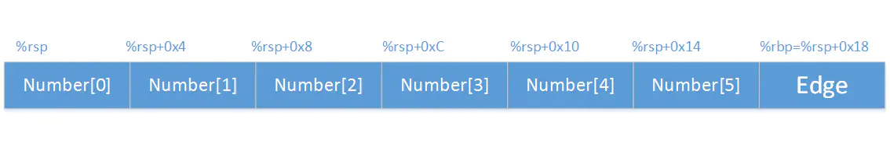
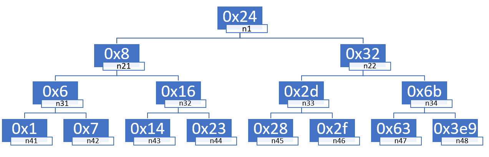

# 拆弹记录

<p style="text-align:right;">by TomatoEater<br>2021年10月</p>

## 0. 准备工作

0）如何读取文件。./bomb \<file\>  注意文件中的换行符必须为LF，不能是CRLF，否则会爆炸。~~不要问我怎么知道~~

1）先把可执行文件反编译成汇编文件

```bash
objdump -d bomb > bomb.s #反编译
```

2）在bomb.c中找到这串代码

```c
 /* Hmm...  Six phases must be more secure than one phase! */
    input = read_line();             /* Get input                   */
    phase_1(input);                  /* Run the phase               */
    phase_defused();                 /* Drat!  They figured it out!
				      * Let me know how they did it. */
    printf("Phase 1 defused. How about the next one?\n");
```

发现六个phase是解决问题的关键

进入gdb调试：

```bash
gdb bomb
```

下面开始正式拆弹！

***


## 1. phase_1

### 1.0 研究read_line函数

找到main函数中phase_1上下文：

```assembly
  400e32:	e8 67 06 00 00       	callq  40149e <read_line>
  400e37:	48 89 c7             	mov    %rax,%rdi
  400e3a:	e8 a1 00 00 00       	callq  400ee0 <phase_1>
  400e3f:	e8 80 07 00 00       	callq  4015c4 <phase_defused>
```

%rax作为默认的函数返回寄存器，再根据read_line的函数名字，猜测%rdi会存刚刚输入的字符串，不妨利用gdb进行测试：

```bash
(gdb) b *0x400e3a #设置breakpoint
(gdb) run
#随便输入啥，比如hello
(gdb) x /s $rdi #查看$rdi寄存器上的字符串，会返回hello
#$rdi里面是一个地址，通过这个地址可以找到这个字符串
```

验证了猜想。而如果去看read_line函数汇编代码，会劝退的。。。

### 1.1 进入phase_1

```assembly
0000000000400ee0 <phase_1>:
  400ee0:	48 83 ec 08          	sub    $0x8,%rsp ;似乎不用栈也要如此
  400ee4:	be 00 24 40 00       	mov    $0x402400,%esi ;有猫腻！
  400ee9:	e8 4a 04 00 00       	callq  401338 <strings_not_equal>
  400eee:	85 c0                	test   %eax,%eax
  400ef0:	74 05                	je     400ef7 <phase_1+0x17> ;条件跳转跳过explode_bomb
  400ef2:	e8 43 05 00 00       	callq  40143a <explode_bomb>
  400ef7:	48 83 c4 08          	add    $0x8,%rsp
  400efb:	c3                   	retq   
```

把0x402400赋到%esi中，再去调用strings_not_equal，再加上之前%rdi存了我们输入的字符串！容易联想到就是比较%esi和%rdi地址的字符串是否相等。而且%rdi默认是第一参数，%rsi是第二参数！于是再去瞄一眼strings_not_equal！

### 1.2 看看strings_not_equal

```assembly
000000000040131b <string_length>:
  40131b:	80 3f 00             	cmpb   $0x0,(%rdi)
...
  401337:	c3                   	retq   

0000000000401338 <strings_not_equal>:
  401338:	41 54                	push   %r12
  40133a:	55                   	push   %rbp
  40133b:	53                   	push   %rbx
  40133c:	48 89 fb             	mov    %rdi,%rbx
  40133f:	48 89 f5             	mov    %rsi,%rbp
  401342:	e8 d4 ff ff ff       	callq  40131b <string_length>
 ...
  4013a1:	c3                   	retq   
```

整个代码又臭又长，看不懂。。。但是显然就是在比较%rdi和%rsi了！而且可以看出当相同时返回0；不相同返回1（额，这可能要看一会儿）。

### 1.3 回到phase_1

```assembly
  400eee:	85 c0                	test   %eax,%eax
  400ef0:	74 05                	je     400ef7 <phase_1+0x17>
```

`test %eax,%eax`是将%eax与%eax做与运算，不改变%eax但是设置条件寄存器。当且仅当%eax值为0时，ZF寄存器会是1。

je通过ZF寄存器是否为1进行条件跳转。如果%eax为0的话，就会跳转，跳过 <explode_bomb>函数，也就是要让`strings_not_equal（%rdi，%rsi）`两个字符串相等即可。

### 1.4 defuse phase_1

```bash
(gdb) x /s 0x402400 #输出0x402400地址存的字符串
0x402400:       "Border relations with Canada have never been better."
```

Border relations with Canada have never been better.即为第一题答案。

***


## 2. phase_2

```assembly
0000000000400efc <phase_2>:
  400efc:	55                   	push   %rbp
  400efd:	53                   	push   %rbx
  400efe:	48 83 ec 28          	sub    $0x28,%rsp
  400f02:	48 89 e6             	mov    %rsp,%rsi
  400f05:	e8 52 05 00 00       	callq  40145c <read_six_numbers>
  400f0a:	83 3c 24 01          	cmpl   $0x1,(%rsp) #%rsp地址上的值减去1
  400f0e:	74 20                	je     400f30 <phase_2+0x34> ;相等时跳
  400f10:	e8 25 05 00 00       	callq  40143a <explode_bomb>
  400f15:	eb 19                	jmp    400f30 <phase_2+0x34>
  400f17:	8b 43 fc             	mov    -0x4(%rbx),%eax
  400f1a:	01 c0                	add    %eax,%eax
  400f1c:	39 03                	cmp    %eax,(%rbx)
  400f1e:	74 05                	je     400f25 <phase_2+0x29>
  400f20:	e8 15 05 00 00       	callq  40143a <explode_bomb>
  400f25:	48 83 c3 04          	add    $0x4,%rbx
  400f29:	48 39 eb             	cmp    %rbp,%rbx
  400f2c:	75 e9                	jne    400f17 <phase_2+0x1b>
  400f2e:	eb 0c                	jmp    400f3c <phase_2+0x40>
  400f30:	48 8d 5c 24 04       	lea    0x4(%rsp),%rbx ;lea加载有效地址，%rbx=%rsp地址加上4字节
  400f35:	48 8d 6c 24 18       	lea    0x18(%rsp),%rbp
  400f3a:	eb db                	jmp    400f17 <phase_2+0x1b>
  400f3c:	48 83 c4 28          	add    $0x28,%rsp
  400f40:	5b                   	pop    %rbx
  400f41:	5d                   	pop    %rbp
  400f42:	c3                   	retq  
```

### 2.1 猜测read_six_numbers函数

当去研究<read_six_numbers>的汇编的时候又开始看不懂了。。。不过可以猜测就是读进去了六个数字。内存分布如下：



这里是一个运行时栈存数组的简单应用。

### 2.4 再看read_six_numbers函数

做完phase_3，弄清楚sscanf函数后，再来看read_six_numbers函数，终于有所眉目。

```assembly
000000000040145c <read_six_numbers>:
  40145c:	48 83 ec 18          	sub    $0x18,%rsp
  401460:	48 89 f2             	mov    %rsi,%rdx
  401463:	48 8d 4e 04          	lea    0x4(%rsi),%rcx
  401467:	48 8d 46 14          	lea    0x14(%rsi),%rax
  40146b:	48 89 44 24 08       	mov    %rax,0x8(%rsp)
  401470:	48 8d 46 10          	lea    0x10(%rsi),%rax
  401474:	48 89 04 24          	mov    %rax,(%rsp)
  401478:	4c 8d 4e 0c          	lea    0xc(%rsi),%r9
  40147c:	4c 8d 46 08          	lea    0x8(%rsi),%r8
  401480:	be c3 25 40 00       	mov    $0x4025c3,%esi
  401485:	b8 00 00 00 00       	mov    $0x0,%eax
  40148a:	e8 61 f7 ff ff       	callq  400bf0 <__isoc99_sscanf@plt>
  40148f:	83 f8 05             	cmp    $0x5,%eax
  401492:	7f 05                	jg     401499 <read_six_numbers+0x3d>
  401494:	e8 a1 ff ff ff       	callq  40143a <explode_bomb>
  401499:	48 83 c4 18          	add    $0x18,%rsp
  40149d:	c3                   	retq   
```

这里就是一个利用运行时栈local variables & argument build area的应用。sscanf此时要有八个参数，类似`sscanf(*str, "%d %d %d %d", &a, &b, &c, &d)`。但是x86寄存器只有rdi、rsi、rdx、rcx、r8、r9可以做为函数参数，还有两个参数就需要利用栈来储存。可以看到：

```assembly
  401467:	48 8d 46 14          	lea    0x14(%rsi),%rax
  40146b:	48 89 44 24 08       	mov    %rax,0x8(%rsp)
  401470:	48 8d 46 10          	lea    0x10(%rsi),%rax
  401474:	48 89 04 24          	mov    %rax,(%rsp)
```

将phase_2栈帧中的两个地址存到了read_six_numbers栈帧之中。而sscanf在子函数中0x8(%rsp)、(%rsp)这两个地址的写入，其实就是在父函数phase_2的0x14+%rsi与0x10+%rsi两个地址进行写入。这就是read_six_numbers栈帧中argument build area的应用。

至于local variables区域体现在phase_2栈帧存了数组这一点上。

总感觉local variables & argument build area两个东西区分不清，有点杂合。2.4就算姑且谈谈而已。

### 2.2 gdb验证猜想

```bash
(gdb) b *0x400f0a #在read_six_numbers后面打断点
(gdb) run
#phase_2输入1 2 3 4 5 6
(gdb) x /24xb $rsp #24个，x十六进制，b一字节，xb顺序任意
0x7fffffffe0d0: 0x01    0x00    0x00    0x00    0x02    0x00    0x00    0x00 #返回值
0x7fffffffe0d8: 0x03    0x00    0x00    0x00    0x04    0x00    0x00    0x00
0x7fffffffe0e0: 0x05    0x00    0x00    0x00    0x06    0x00    0x00    0x00
```

印证了之前的猜想，注意到这里是小端表示法。这里的rsp存的地址也很有栈的味道（0x7ffffff开头）。

### 2.3 dufuse phase_2

通过阅读phase_2的汇编代码，容易看出答案是1 2 4 8 16 32（这应该不难，就是一个do while循环）。

***


## 3. phase_3

```assembly
0000000000400f43 <phase_3>:
  400f43:	48 83 ec 18          	sub    $0x18,%rsp
  400f47:	48 8d 4c 24 0c       	lea    0xc(%rsp),%rcx
  400f4c:	48 8d 54 24 08       	lea    0x8(%rsp),%rdx
  400f51:	be cf 25 40 00       	mov    $0x4025cf,%esi
  400f56:	b8 00 00 00 00       	mov    $0x0,%eax
  400f5b:	e8 90 fc ff ff       	callq  400bf0 <__isoc99_sscanf@plt> ;以上部分分析见代码后
  400f60:	83 f8 01             	cmp    $0x1,%eax ;sscanf返回值和1比大小
  400f63:	7f 05                	jg     400f6a <phase_3+0x27> ;如果大的话，就跳过爆炸
  400f65:	e8 d0 04 00 00       	callq  40143a <explode_bomb>
  400f6a:	83 7c 24 08 07       	cmpl   $0x7,0x8(%rsp) ;0x8(%rsp)地址上的值和7比大小
  400f6f:	77 3c                	ja     400fad <phase_3+0x6a> ;如果大的话，就跳到爆炸
  -----------------------↑sscanf；↓switch--------------------------------------------------
  400f71:	8b 44 24 08          	mov    0x8(%rsp),%eax
  400f75:	ff 24 c5 70 24 40 00 	jmpq   *0x402470(,%rax,8)
  400f7c:	b8 cf 00 00 00       	mov    $0xcf,%eax
  400f81:	eb 3b                	jmp    400fbe <phase_3+0x7b>
  400f83:	b8 c3 02 00 00       	mov    $0x2c3,%eax
  400f88:	eb 34                	jmp    400fbe <phase_3+0x7b>
  400f8a:	b8 00 01 00 00       	mov    $0x100,%eax
  400f8f:	eb 2d                	jmp    400fbe <phase_3+0x7b>
  400f91:	b8 85 01 00 00       	mov    $0x185,%eax
  400f96:	eb 26                	jmp    400fbe <phase_3+0x7b>
  400f98:	b8 ce 00 00 00       	mov    $0xce,%eax
  400f9d:	eb 1f                	jmp    400fbe <phase_3+0x7b>
  400f9f:	b8 aa 02 00 00       	mov    $0x2aa,%eax
  400fa4:	eb 18                	jmp    400fbe <phase_3+0x7b>
  400fa6:	b8 47 01 00 00       	mov    $0x147,%eax
  400fab:	eb 11                	jmp    400fbe <phase_3+0x7b>
  400fad:	e8 88 04 00 00       	callq  40143a <explode_bomb>
  400fb2:	b8 00 00 00 00       	mov    $0x0,%eax
  400fb7:	eb 05                	jmp    400fbe <phase_3+0x7b>
  400fb9:	b8 37 01 00 00       	mov    $0x137,%eax
  400fbe:	3b 44 24 0c          	cmp    0xc(%rsp),%eax
  400fc2:	74 05                	je     400fc9 <phase_3+0x86>
  400fc4:	e8 71 04 00 00       	callq  40143a <explode_bomb>
  400fc9:	48 83 c4 18          	add    $0x18,%rsp
  400fcd:	c3                   	retq   
```

### 3.1 \<__isoc99_sscanf@plt>

这里调用了sscanf函数，函数原型为`int sscanf(const char *str, const char *format, ...)`，譬如sscanf("hello 1", "%s %d", str, a)返回2且str=“hello”，a=1。根据x86汇编关于寄存器的约定，这里是`sccanf(%rdi, %rsi, %rdx, %rcx)`。%rdi是main函数的read_line输入，%rsi是格式化参数，%rdx和%rcx分别是两个存放输入的局部变量地址。由`lea 0xc(%rsp),%rcx`以及`lea 0x8(%rsp),%rdx`知道局部变量的地址。利用gdb进行验证，有：

```bash
#$esi存放格式化参数
(gdb) b *0x400f56
...
(gdb) x /s $esi
0x4025cf:       "%d %d"
```

```bash
#查看0x8(%rsp)和0xc(%rsp)，之前输入1 2
(gdb) x /dw $rsp + 8 #d十进制，w四字节，wd亦可
0x7fffffffe0f8: 1
(gdb) x /dw $rsp + 0xc
0x7fffffffe0f8: 2
```

```bash
#查看sscanf调用后的寄存器(只列出部分)
(gdb) i register
rcx            0x0                 0
rdx            0x7fffffffe0fc      140737488347388
rsi            0x0                 0
```

有意思的是sscanf把传进去的寄存器值修改过了。rcx不再是0xc(%rsp)，rci也不再是0x4025cf

### 3.2 switch

显然后半部分代码是一个switch的实现，可以看出只要输入的a、b两个数满足——b是case a中的值，就可以成功拆弹。

`jmpq *0x402470(,%rax,8)`是一个跳转表的实现，\*意味着是**间接**跳转到该地址，这里就是下一条指令跳转到0x402470+8\*%rax这个内存地址上存的地址。再强调一下jmp指令。jmp有直接跳转和间接跳转、无条件跳转和条件跳转之说，其中条件跳转必为直接跳转。直接跳转如jmp .L2就是下一条指令从.L2:处开始；间接跳转，如jmp *%rax跳转到寄存器%rax所存的值（该值是一个地址），再如jmp *(%rax)跳转到内存地址(%rax)上所存的值（自然该值也是个地址）。

通过gdb查看0x402470附近的值

```bash
(gdb) x /64xb 0x402470
0x402470:       0x7c    0x0f    0x40    0x00    0x00    0x00    0x00    0x00
0x402478:       0xb9    0x0f    0x40    0x00    0x00    0x00    0x00    0x00
0x402480:       0x83    0x0f    0x40    0x00    0x00    0x00    0x00    0x00
0x402488:       0x8a    0x0f    0x40    0x00    0x00    0x00    0x00    0x00
0x402490:       0x91    0x0f    0x40    0x00    0x00    0x00    0x00    0x00
0x402498:       0x98    0x0f    0x40    0x00    0x00    0x00    0x00    0x00
0x4024a0:       0x9f    0x0f    0x40    0x00    0x00    0x00    0x00    0x00
0x4024a8:       0xa6    0x0f    0x40    0x00    0x00    0x00    0x00    0x00
```

至此所有拆弹前期工作做完。

### 3.3 defuse phase_3

如果第一个数输入1，在跳转表中找到`0x402478:   0xb9  0x0f  0x40`也就是跳转到0x400fb9，也就是`400fb9:	b8 37 01 00 00 	mov $0x137,%eax`。得到一组答案：1 311。完成拆弹！

当然也可以第一个输入1后利用`(gdb) ni`单步调试，发现下一条指令跳转到0x400fb9，也可以完成拆弹。第一次我是这么做的，但是当时显然对间接跳转理解不深。

***


## 4. phase_4

话不多说，先上phase_4代码

```assembly
000000000040100c <phase_4>:
  40100c:	48 83 ec 18          	sub    $0x18,%rsp
  401010:	48 8d 4c 24 0c       	lea    0xc(%rsp),%rcx
  401015:	48 8d 54 24 08       	lea    0x8(%rsp),%rdx
  40101a:	be cf 25 40 00       	mov    $0x4025cf,%esi
  40101f:	b8 00 00 00 00       	mov    $0x0,%eax
  401024:	e8 c7 fb ff ff       	callq  400bf0 <__isoc99_sscanf@plt>
  401029:	83 f8 02             	cmp    $0x2,%eax ;读入的整数个数一定要等于2
  40102c:	75 07                	jne    401035 <phase_4+0x29> ;否则跳转到炸弹
  40102e:	83 7c 24 08 0e       	cmpl   $0xe,0x8(%rsp) ;读入的第一个整数一定要小于等于14
  401033:	76 05                	jbe    40103a <phase_4+0x2e> ;这要才能跳过炸弹
  401035:	e8 00 04 00 00       	callq  40143a <explode_bomb>
  ------------------------func4前---------------------------------------
  40103a:	ba 0e 00 00 00       	mov    $0xe,%edx ;开始为func4做准备
  40103f:	be 00 00 00 00       	mov    $0x0,%esi
  401044:	8b 7c 24 08          	mov    0x8(%rsp),%edi
  401048:	e8 81 ff ff ff       	callq  400fce <func4>
  ------------------------func4后---------------------------------------
  40104d:	85 c0                	test   %eax,%eax ;到底eax是否为0
  40104f:	75 07                	jne    401058 <phase_4+0x4c> ;才不会跳到炸弹？
  401051:	83 7c 24 0c 00       	cmpl   $0x0,0xc(%rsp) ;当年输入的第二个整数也有要求！
  401056:	74 05                	je     40105d <phase_4+0x51> ;第二个整数为0，可以跳过炸弹
  401058:	e8 dd 03 00 00       	callq  40143a <explode_bomb>
  40105d:	48 83 c4 18          	add    $0x18,%rsp
  401061:	c3                   	retq   
```

### 4.1 func4前

这里的汇编代码已经很熟悉了。容易知道这里要输入两个整数，并且第一个整数要小于等于14。不多说了。

### 4.2 func4后

func4后有一个小点要搞清楚，到底返回什么eax值才不会跳到炸弹呢？jne是由\~ZF条件寄存器判断跳转，这里要不跳转，所以\~ZF为0，也就是ZF=1。当且仅当%eax等于零时，`test %eax, %eax`才设置ZF为1。所以这里要func4返回的eax值等于0！

此外，还可以分析出，之前输入的第二个整数一定为0。这里不做展开。

### 4.3 困难的func4

在进入func4之前，我们给%edi、%esi、%edx三个寄存器设置了初值，所以可以得到`int func4(int a, int b, int c)`这个函数原型。可能有疑问，之前的%rcx也有初值，为什么不作func4的参数。这是因为%rcx是sscanf的参数，在sscanf结束后，%rcx的值是没有意义的。（不过如果进入函数的时候pop进了栈，这样也可以保存寄存器欸）

**func4启动！！！**

```assembly
0000000000400fce <func4>:
  400fce:	48 83 ec 08          	sub    $0x8,%rsp
  400fd2:	89 d0                	mov    %edx,%eax
  400fd4:	29 f0                	sub    %esi,%eax
  400fd6:	89 c1                	mov    %eax,%ecx
  400fd8:	c1 e9 1f             	shr    $0x1f,%ecx ;逻辑右移
  400fdb:	01 c8                	add    %ecx,%eax
  400fdd:	d1 f8                	sar    %eax ;算术右移
  400fdf:	8d 0c 30             	lea    (%rax,%rsi,1),%ecx
  400fe2:	39 f9                	cmp    %edi,%ecx
  400fe4:	7e 0c                	jle    400ff2 <func4+0x24>
  400fe6:	8d 51 ff             	lea    -0x1(%rcx),%edx
  400fe9:	e8 e0 ff ff ff       	callq  400fce <func4>
  400fee:	01 c0                	add    %eax,%eax
  400ff0:	eb 15                	jmp    401007 <func4+0x39>
  400ff2:	b8 00 00 00 00       	mov    $0x0,%eax
  400ff7:	39 f9                	cmp    %edi,%ecx
  400ff9:	7d 0c                	jge    401007 <func4+0x39>
  400ffb:	8d 71 01             	lea    0x1(%rcx),%esi
  400ffe:	e8 cb ff ff ff       	callq  400fce <func4>
  401003:	8d 44 00 01          	lea    0x1(%rax,%rax,1),%eax
  401007:	48 83 c4 08          	add    $0x8,%rsp
  40100b:	c3                   	retq   
```

func4困难就困难在于它是一个递归函数（自己调用自己），在分析的过程中很容易超过脑子内存。。。于是需要把它化成C程序来进行分析。但是化成c程序的过程也很有挑战性！**这里先强调一点：`cmp a,b   jle .L1`是b≤a才跳转到L1！！！**

**直译版**

```c
int func4(int edi, int esi, int edx)
{
    int eax = edx;
    eax -= esi;
    unsigned int ecx = eax;
    ecx >> 31; //逻辑右移
    eax += ecx;
    eax >> 1; //算术右移
    ecx = eax + esi;
    if (ecx <= edi)
    {
        eax = 0;
        if (ecx >= edi)
            return eax;
        else
        {
            esi = ecx + 1;
            eax = func4(edi, esi, edx);
            eax = 2 * eax + 1;
            return eax;
        }
    }
    else
    {
        edx = ecx - 1;
        eax = func4(edi, esi, edx);
        eax *= 2;
        return eax;
    }
}
```

**意译版**

```c
int func4(int a, int b, int c)
{
    int sign = !!((c-b) >> 31); //取c-a的符号位，由a<=14保证这里其实就是0
    int judge = (sign + c - b) / 2 + b; //这里就是(c-a)/2+b
    if (a == judge) return 0;
    else if (a > judge)  return 2 * func4(a, judge+1, c) + 1;
    else return 2 * func4(a, b, judge-1);
}
```

### 4.4 defuse phase_4

现在只要找到那些让func4(a, 0, 14)返回0的a值即可，且a小于等于14。直接打表：`0: 0; 1: 0; 2: 4; 3: 0; 4: 2; 5: 2; 6: 6; 7: 0; 8: 1; 9: 1; 10: 5; 11: 1; 12: 3; 13: 3; 14: 7;`发现0、1、3、7四个值符合规则。于是答案可以为0 0、1 0、3 0以及7 0。完成拆弹！

### 4.5 番外

本拆弹最初是和wnhheu在上院完成，在多处分析出错的情况下，居然一遍拆弹成功。原来是马原课，却一起找了一个空教室，用教室的投影仪和黑板拆弹。我后面感觉分析不清的时候就放弃了，但是wnhheu还是坚持了下来并报出了正确的答案。很有意思，特此记录。

***

## 5. phase_5

冷知识：phase_5是本人拆弹最快的一个

```assembly
0000000000401062 <phase_5>:
  401062:	53                   	push   %rbx
  401063:	48 83 ec 20          	sub    $0x20,%rsp
  401067:	48 89 fb             	mov    %rdi,%rbx
  ---------------------------↓金丝雀（canary）------------------------- 
  40106a:	64 48 8b 04 25 28 00 	mov    %fs:0x28,%rax
  401071:	00 00 
  401073:	48 89 44 24 18       	mov    %rax,0x18(%rsp)
  ---------------------------↑金丝雀（canary）-------------------------
  401078:	31 c0                	xor    %eax,%eax ;eax置为0
  40107a:	e8 9c 02 00 00       	callq  40131b <string_length>
  40107f:	83 f8 06             	cmp    $0x6,%eax ;一定要输入六个字符
  401082:	74 4e                	je     4010d2 <phase_5+0x70> ;就可以跳过炸弹
  401084:	e8 b1 03 00 00       	callq  40143a <explode_bomb>
  401089:	eb 47                	jmp    4010d2 <phase_5+0x70>
  ----------------------------↓关键代码部分---------------------------------
  40108b:	0f b6 0c 03          	movzbl (%rbx,%rax,1),%ecx ;rax：for循环中的i；把单个字符读到ecx
  40108f:	88 0c 24             	mov    %cl,(%rsp) ;ecx的后八位放到%rsp地址的内存中
  401092:	48 8b 14 24          	mov    (%rsp),%rdx ;再把%rsp地址的内存中的值，放到rdx中
  401096:	83 e2 0f             	and    $0xf,%edx ;edx只有后四位了！其余位全置零
  401099:	0f b6 92 b0 24 40 00 	movzbl 0x4024b0(%rdx),%edx ;有猫腻！！！
  4010a0:	88 54 04 10          	mov    %dl,0x10(%rsp,%rax,1) ;edx后四位放到栈的局部变量区
  4010a4:	48 83 c0 01          	add    $0x1,%rax ;i++
  4010a8:	48 83 f8 06          	cmp    $0x6,%rax ;i<6
  4010ac:	75 dd                	jne    40108b <phase_5+0x29> ;i!=6就继续for loop
  4010ae:	c6 44 24 16 00       	movb   $0x0,0x16(%rsp) ;给刚刚的字符串加上'\0'
  4010b3:	be 5e 24 40 00       	mov    $0x40245e,%esi ;喝！<strings_not_equal>第二个参数
  4010b8:	48 8d 7c 24 10       	lea    0x10(%rsp),%rdi ;<strings_not_equal>第一个参数
  4010bd:	e8 76 02 00 00       	callq  401338 <strings_not_equal>
  4010c2:	85 c0                	test   %eax,%eax ;返回值为0，就是两个字符串相等
  4010c4:	74 13                	je     4010d9 <phase_5+0x77> ;便可以跳过炸弹
  ----------------------------↑关键代码部分-----------------------------------
  4010c6:	e8 6f 03 00 00       	callq  40143a <explode_bomb>
  4010cb:	0f 1f 44 00 00       	nopl   0x0(%rax,%rax,1) ;no operation，具体干啥不清楚
  4010d0:	eb 07                	jmp    4010d9 <phase_5+0x77>
  4010d2:	b8 00 00 00 00       	mov    $0x0,%eax
  4010d7:	eb b2                	jmp    40108b <phase_5+0x29>
  ---------------------------↓金丝雀（canary）------------------------- 
  4010d9:	48 8b 44 24 18       	mov    0x18(%rsp),%rax
  4010de:	64 48 33 04 25 28 00 	xor    %fs:0x28,%rax
  4010e5:	00 00 
  4010e7:	74 05                	je     4010ee <phase_5+0x8c>
  4010e9:	e8 42 fa ff ff       	callq  400b30 <__stack_chk_fail@plt>
  ---------------------------↑金丝雀（canary）-----------------------------
  4010ee:	48 83 c4 20          	add    $0x20,%rsp
  4010f2:	5b                   	pop    %rbx
  4010f3:	c3                   	retq  
```

### 5.1 金丝雀值

金丝雀是一种防止*内存越界引用和缓冲区溢出*的手段。具体为：在该函数栈帧中的局部变量区与栈状态（返回地址和寄存器保存区）之间存入一个随机的金丝雀值（Canary），然后在恢复寄存器状态和返回返回地址之前，会检测该值是否发生变化，如果发生变化，则程序异常终止。 在这个程序中：`movq %fs:28, %rax`把canary值赋到%rax中；再把%rax赋到栈帧上；一些指令后，把栈帧该处的值赋回%rax；最后`xor %fs:40, %rax`可以检测canary值是否被修改。

### 5.2 非关键代码部分

都做到phase_5了，具体就不展开了。就是要输入六个字符，否则要爆炸。

### 5.3关键代码部分

显然这里可以是一个for循环，把输入的字符串中的每一个字符通过`0x4024b0(%rdx),%edx`这个奇怪的操作变成另一个字符！另一个字符利用gdb查看：

```bash
(gdb) x /s 0x40245e
0x40245e:       "flyers"
```

可见映射出来的字符串为"flyers"。

而**关键中的关键**是`0x4024b0(%rdx),%edx`这个到底是什么映射？

分析代码我们可以看出，寄存器%rdx只有最初字符的后四位，其余为都为零。那么这个数再加上0x4024b0，就可以得到映射到的地址了。也就是说地址映射是这样一个函数：$f(x) = 0x4024b0+x (0 \le x \le 0xF)$，其中x是字符的后四位。（ASCII码是用八位来存的）

查看0x4024b0到0x4024b0+0xf的内存有：

```bash
(gdb) x /16xb 0x4024b0
0x4024b0 <array.3449>:  0x6d    0x61    0x64    0x75    0x69    0x65    0x72    0x73
0x4024b8 <array.3449+8>:        0x6e    0x66    0x6f    0x74    0x76    0x62    0x79    0x6c
```

flyers的ASCII码分别是：0x66 0x6c 0x79 0x65 0x72 0x73。对应着<array.3449>的第9、f、e、5、6、7位置（0-base）。于是只要找到最后四位是它们的字符即可！

顺带一提这个数组存了还存了之前看到过的So you think you can stop the bomb with ctrl-c, do you?。摊手.jpg

```bash4
(gdb) x /s 0x4024b0
0x4024b0 <array.3449>:  "maduiersnfotvbylSo you think you can stop the bomb with ctrl-c, do you?"
```

### 5.4 defuse phase_5

也就是找最后四位分别为9、f、e、5、6、7的字符即可，查查ASCII表就行了。正常的可以是：ionefg     不正常的可以是：)?>%&'

答案不唯一。

***


## 6. phase_6

phase_6代码真是又臭又长

```assembly
00000000004010f4 <phase_6>:
  4010f4:	41 56                	push   %r14
  4010f6:	41 55                	push   %r13
  4010f8:	41 54                	push   %r12
  4010fa:	55                   	push   %rbp
  4010fb:	53                   	push   %rbx
  4010fc:	48 83 ec 50          	sub    $0x50,%rsp
  401100:	49 89 e5             	mov    %rsp,%r13
  401103:	48 89 e6             	mov    %rsp,%rsi
  401106:	e8 51 03 00 00       	callq  40145c <read_six_numbers> ;读入六个整数
  -------------------------↑part1--part2↓------------------------------
  40110b:	49 89 e6             	mov    %rsp,%r14
  40110e:	41 bc 00 00 00 00    	mov    $0x0,%r12d ;int i = 0
  401114:	4c 89 ed             	mov    %r13,%rbp ;r13是第i个整数的地址（0-base）
  401117:	41 8b 45 00          	mov    0x0(%r13),%eax ;%eax是第i个整数（0-base）
  40111b:	83 e8 01             	sub    $0x1,%eax ;%eax存的整数减一后
  40111e:	83 f8 05             	cmp    $0x5,%eax ;与5作比较
  401121:	76 05                	jbe    401128 <phase_6+0x34> ;如果小于等于5，就跳过炸弹
  401123:	e8 12 03 00 00       	callq  40143a <explode_bomb>
  401128:	41 83 c4 01          	add    $0x1,%r12d ;i++
  40112c:	41 83 fc 06          	cmp    $0x6,%r12d ;i==6吗
  401130:	74 21                	je     401153 <phase_6+0x5f> ;等于就跳出part2，进入part3
  401132:	44 89 e3             	mov    %r12d,%ebx ;int j = i （注意这里i已经加过1了）
  401135:	48 63 c3             	movslq %ebx,%rax
  401138:	8b 04 84             	mov    (%rsp,%rax,4),%eax ;把第j个整数存入%eax（0-base）
  40113b:	39 45 00             	cmp    %eax,0x0(%rbp) ;第j个整数和第i-1个整数比较（0-base）
  40113e:	75 05                	jne    401145 <phase_6+0x51> ;不相等，就跳过炸弹
  401140:	e8 f5 02 00 00       	callq  40143a <explode_bomb>
  401145:	83 c3 01             	add    $0x1,%ebx ;j++
  401148:	83 fb 05             	cmp    $0x5,%ebx ;j<=5吗
  40114b:	7e e8                	jle    401135 <phase_6+0x41> ;j<=5就继续j循环
  40114d:	49 83 c5 04          	add    $0x4,%r13 ;r13更新为第i+1个整数的地址（0-base）
  401151:	eb c1                	jmp    401114 <phase_6+0x20> ;继续i循环
  -------------------------↑part2--part3↓------------------------------
  401153:	48 8d 74 24 18       	lea    0x18(%rsp),%rsi ;循环终止条件0x18(%rsp)
  401158:	4c 89 f0             	mov    %r14,%rax ;i，遍历数组用
  40115b:	b9 07 00 00 00       	mov    $0x7,%ecx ;接下四步完成七减去这个数
  401160:	89 ca                	mov    %ecx,%edx
  401162:	2b 10                	sub    (%rax),%edx
  401164:	89 10                	mov    %edx,(%rax)
  401166:	48 83 c0 04          	add    $0x4,%rax ;i+=0x4
  40116a:	48 39 f0             	cmp    %rsi,%rax ;i!=0x18(%rsp)
  40116d:	75 f1                	jne    401160 <phase_6+0x6c>
  -------------------------↑part3--part4↓------------------------------
  40116f:	be 00 00 00 00       	mov    $0x0,%esi ;i，遍历数组用，为方便认为i范围0~5
  401174:	eb 21                	jmp    401197 <phase_6+0xa3>
  401176:	48 8b 52 08          	mov    0x8(%rdx),%rdx ;相当于链表中p=p->next
  40117a:	83 c0 01             	add    $0x1,%eax ;j++
  40117d:	39 c8                	cmp    %ecx,%eax ;j与第i个数比较
  40117f:	75 f5                	jne    401176 <phase_6+0x82> ;不等继续p=p->next
  401181:	eb 05                	jmp    401188 <phase_6+0x94> ;相等就可以存起来
  401183:	ba d0 32 60 00       	mov    $0x6032d0,%edx ;有猫腻！edx存第一个节点地址
  401188:	48 89 54 74 20       	mov    %rdx,0x20(%rsp,%rsi,2) ;在栈帧相关位置存nodej地址
  40118d:	48 83 c6 04          	add    $0x4,%rsi ;i++
  401191:	48 83 fe 18          	cmp    $0x18,%rsi ;i与6比较
  401195:	74 14                	je     4011ab <phase_6+0xb7> ;如果i==6，进入part5
  401197:	8b 0c 34             	mov    (%rsp,%rsi,1),%ecx ;%ecx存了第i个数
  40119a:	83 f9 01             	cmp    $0x1,%ecx ;该数与一比较
  40119d:	7e e4                	jle    401183 <phase_6+0x8f> ;小于等于1，跳转
  40119f:	b8 01 00 00 00       	mov    $0x1,%eax ;j，遍历节点用，j范围1~6
  4011a4:	ba d0 32 60 00       	mov    $0x6032d0,%edx ;有猫腻！edx存第一个节点地址
  4011a9:	eb cb                	jmp    401176 <phase_6+0x82>
  -------------------------↑part4--part5↓------------------------------
  4011ab:	48 8b 5c 24 20       	mov    0x20(%rsp),%rbx ;%rbx存<nodeA>地址
  4011b0:	48 8d 44 24 28       	lea    0x28(%rsp),%rax ;存了<nodeB>地址的地址
  4011b5:	48 8d 74 24 50       	lea    0x50(%rsp),%rsi ;循环终止条件
  4011ba:	48 89 d9             	mov    %rbx,%rcx ;%rcx初始化为<nodeA>地址
  4011bd:	48 8b 10             	mov    (%rax),%rdx ;%rdx是%rcx下一节点的地址
  4011c0:	48 89 51 08          	mov    %rdx,0x8(%rcx) ;将%rcx的next指针指向%rdx
  4011c4:	48 83 c0 08          	add    $0x8,%rax
  4011c8:	48 39 f0             	cmp    %rsi,%rax ;判断循环终止
  4011cb:	74 05                	je     4011d2 <phase_6+0xde>
  4011cd:	48 89 d1             	mov    %rdx,%rcx
  4011d0:	eb eb                	jmp    4011bd <phase_6+0xc9>
  4011d2:	48 c7 42 08 00 00 00 	movq   $0x0,0x8(%rdx)
  4011d9:	00 
  -------------------------↑part5--part6↓------------------------------
  4011da:	bd 05 00 00 00       	mov    $0x5,%ebp
  4011df:	48 8b 43 08          	mov    0x8(%rbx),%rax ;%rbx还存着<nodeA>地址
  4011e3:	8b 00                	mov    (%rax),%eax ;eax存<nodeB>地址上的值
  4011e5:	39 03                	cmp    %eax,(%rbx) ;<nodeA>地址的值与<nodeB>地址上的值做比较
  4011e7:	7d 05                	jge    4011ee <phase_6+0xfa> ;如果<nodeA>的大，就跳过炸弹
  4011e9:	e8 4c 02 00 00       	callq  40143a <explode_bomb>
  4011ee:	48 8b 5b 08          	mov    0x8(%rbx),%rbx 
  4011f2:	83 ed 01             	sub    $0x1,%ebp
  4011f5:	75 e8                	jne    4011df <phase_6+0xeb>
  4011f7:	48 83 c4 50          	add    $0x50,%rsp
  4011fb:	5b                   	pop    %rbx
  4011fc:	5d                   	pop    %rbp
  4011fd:	41 5c                	pop    %r12
  4011ff:	41 5d                	pop    %r13
  401201:	41 5e                	pop    %r14
  401203:	c3                   	retq   
```

可以把phase_6的代码分成六个部分，我们逐一解读。其实phase_6也并不是很难，只不过需要十足的耐心。

### 6.1 part1-输入六个数

part1部分再在2.4已经详细讲过了，就是读入六个整数，并将其放在%rsp、%rsp+0x4、...、%rsp+0x20这六个位置。也就是在栈里面存了数组。不做展开。

### 6.2 part2-输入的要求

稍有点麻烦。这里就是个嵌套循环，具体解释可以看注释。翻译出来的C代码如下：

```c
int a[6];
for (int i = 0; i != 6; i++)
{
    if (a[i] > 6)
        explode_bomb();
    for (int j = i+1; j <= 5; j++)
    {
        if (a[i] == a[j])
            explode_bomb();
	}
}
```

可见输入的六个整数首先要满足两两不同且都小于等于6。于是可以不触发炸弹，进入part3了。

### 6.3 part3-修改输入的数

part3不难，就是数组的六个数分别变成7减去它自己。也就是假设原来数是a，现在变成7-a。比较简单，不做展开。

### 6.4 part4-虚假的链表

part4算是phase_6的难点了。这里就先放结论了：假设现在的数组是[A, B, C, D, E, F]（均为1~6整数），那么在栈帧的%rsp+0x20到%rsp+0x48地址分别存了\<nodeA\>、\<nodeB>、...、\<nodeF\>的地址。利用gdb可以看到以下\<node\>数据：

```bash
(gdb) x /96xb 0x6032d0
0x6032d0 <node1>:       0x4c    0x01    0x00    0x00    0x01    0x00    0x00    0x00
0x6032d8 <node1+8>:     0xe0    0x32    0x60    0x00    0x00    0x00    0x00    0x00
0x6032e0 <node2>:       0xa8    0x00    0x00    0x00    0x02    0x00    0x00    0x00
0x6032e8 <node2+8>:     0xf0    0x32    0x60    0x00    0x00    0x00    0x00    0x00
0x6032f0 <node3>:       0x9c    0x03    0x00    0x00    0x03    0x00    0x00    0x00
0x6032f8 <node3+8>:     0x00    0x33    0x60    0x00    0x00    0x00    0x00    0x00
0x603300 <node4>:       0xb3    0x02    0x00    0x00    0x04    0x00    0x00    0x00
0x603308 <node4+8>:     0x10    0x33    0x60    0x00    0x00    0x00    0x00    0x00
0x603310 <node5>:       0xdd    0x01    0x00    0x00    0x05    0x00    0x00    0x00
0x603318 <node6>:       0xbb    0x01    0x00    0x00    0x06    0x00    0x00    0x00
0x603328 <node6+8>:     0x00    0x00    0x00    0x00    0x00    0x00    0x00    0x00
```

下面做一定的解读：

这里是一个用数组存的链表，用C描述如下：

```c
struct node
{
    int value;
    int index;
    node *next;
};
void buildList()
{
    node list[6];
    for (int i = 0; i < 5; i++)
    {
        list[i].next = &list[i+1];
        list[i].index = i+1;
        list[i].value = 某个value;
    }
}
```

可见该链表满足\<node1\>地址加0x8的地址上存\<node2\>的地址，\<node2\>地址加0x8的地址上存\<node3\>的地址，以此类推。

part4也有嵌套循环，外层循环利用%esi遍历数组，在%ecx中存了数组里具体的数。利用%eax来遍历节点，在%rdx存了节点的地址。通过比较%ecx和%eax，利用`mov 0x8(%rdx),%rdx` ，实现链表中p=p->next的操作。最后将%rdx值（也就是第%ecx个节点的地址）存到栈帧的指定区域。这里遍历节点是1-base的，所以可以得到之前输入的六个数除了满足小于等于6的条件外，还要大于等于1。

### 6.5 part5-重排链表

这里还行。就是在\<nodeA\>地址加0x8的地址上存\<nodeB\>的地址，在\<nodeB\>地址加0x8的地址上存\<nodeC\>的地址，以此类推。而原来节点是\<node1\>地址加0x8的地址上存\<node2\>的地址，\<node2\>地址加0x8的地址上存\<node3\>的地址，以此类推。这样刚刚虚假的链表，变得高级真实起来了。比如输入`4 3 2 1 6 5`，7减去它们变成`3 4 5 6 1 2`。利用gdb查看更新后的链表有：

```bash
(gdb) x /96xb 0x6032d0
0x6032d0 <node1>:       0x4c    0x01    0x00    0x00    0x01    0x00    0x00    0x00
0x6032d8 <node1+8>:     0xe0    0x32    0x60    0x00    0x00    0x00    0x00    0x00
0x6032e0 <node2>:       0xa8    0x00    0x00    0x00    0x02    0x00    0x00    0x00
0x6032e8 <node2+8>:     0x00    0x00    0x00    0x00    0x00    0x00    0x00    0x00
0x6032f0 <node3>:       0x9c    0x03    0x00    0x00    0x03    0x00    0x00    0x00
0x6032f8 <node3+8>:     0x00    0x33    0x60    0x00    0x00    0x00    0x00    0x00
0x603300 <node4>:       0xb3    0x02    0x00    0x00    0x04    0x00    0x00    0x00
0x603308 <node4+8>:     0x10    0x33    0x60    0x00    0x00    0x00    0x00    0x00
0x603310 <node5>:       0xdd    0x01    0x00    0x00    0x05    0x00    0x00    0x00
0x603318 <node5+8>:     0x20    0x33    0x60    0x00    0x00    0x00    0x00    0x00
0x603320 <node6>:       0xbb    0x01    0x00    0x00    0x06    0x00    0x00    0x00
0x603328 <node6+8>:     0xd0    0x32    0x60    0x00    0x00    0x00    0x00    0x00
```

符合`node3->node4->node5->node6->node1->node2->NULL`

### 6.6 part6-defuse phase_6

这里也不难了，就是要求\<nodeA\>地址上的值大于等于\<nodeB\>的，\<nodeB\>的大于\<nodeC\>的。注意这里的值都是32位的int，所以只取低32位。按照从大到小排列，依次是0x39c、0x2b3、0x1dd、0x1bb、0x14c、0xa8。对应节点依次为3、4、5、6、1、2。由于最初用7减去输入的数，所以答案是4 3 2 1 6 5。本题答案只有一个。

至此，六个炸弹全部被拆除。

***


## 7. secret_phase

然而Bomb Lab还安排了一个secret_phase要拆。。。其实给足了暗示：

1. bomb.c中有

```c
/* Wow, they got it!  But isn't something... missing?  Perhaps
 * something they overlooked?  Mua ha ha ha ha! */
```

2. 在\<phase_6\>汇编后面还有\<fun7\>和\<secret_phase\>

既然有，那就拆！

### 7.1 进入secret_phase

在<phase_defused>找到\<secret_phase\>的调用：

```assembly
00000000004015c4 <phase_defused>:
  4015c4:	48 83 ec 78          	sub    $0x78,%rsp
  4015c8:	64 48 8b 04 25 28 00 	mov    %fs:0x28,%rax
  4015cf:	00 00 
  4015d1:	48 89 44 24 68       	mov    %rax,0x68(%rsp)
  4015d6:	31 c0                	xor    %eax,%eax
  4015d8:	83 3d 81 21 20 00 06 	cmpl   $0x6,0x202181(%rip)        # 603760 <num_input_strings>
  4015df:	75 5e                	jne    40163f <phase_defused+0x7b> # 不是phase_6就直接return
  4015e1:	4c 8d 44 24 10       	lea    0x10(%rsp),%r8
  4015e6:	48 8d 4c 24 0c       	lea    0xc(%rsp),%rcx
  4015eb:	48 8d 54 24 08       	lea    0x8(%rsp),%rdx
  4015f0:	be 19 26 40 00       	mov    $0x402619,%esi
  4015f5:	bf 70 38 60 00       	mov    $0x603870,%edi # 读入字符串是何方神圣？
  4015fa:	e8 f1 f5 ff ff       	callq  400bf0 <__isoc99_sscanf@plt>
  4015ff:	83 f8 03             	cmp    $0x3,%eax # 如果没有读到第三个参数，就return
  401602:	75 31                	jne    401635 <phase_defused+0x71>
  401604:	be 22 26 40 00       	mov    $0x402622,%esi # 正确的参数！
  401609:	48 8d 7c 24 10       	lea    0x10(%rsp),%rdi
  40160e:	e8 25 fd ff ff       	callq  401338 <strings_not_equal>
  401613:	85 c0                	test   %eax,%eax
  401615:	75 1e                	jne    401635 <phase_defused+0x71> # 如果第三个参数错误，也return
  401617:	bf f8 24 40 00       	mov    $0x4024f8,%edi
  40161c:	e8 ef f4 ff ff       	callq  400b10 <puts@plt>
  401621:	bf 20 25 40 00       	mov    $0x402520,%edi
  401626:	e8 e5 f4 ff ff       	callq  400b10 <puts@plt>
  40162b:	b8 00 00 00 00       	mov    $0x0,%eax
  401630:	e8 0d fc ff ff       	callq  401242 <secret_phase>
  401635:	bf 58 25 40 00       	mov    $0x402558,%edi
  40163a:	e8 d1 f4 ff ff       	callq  400b10 <puts@plt>
  40163f:	48 8b 44 24 68       	mov    0x68(%rsp),%rax
  401644:	64 48 33 04 25 28 00 	xor    %fs:0x28,%rax
  40164b:	00 00 
  40164d:	74 05                	je     401654 <phase_defused+0x90>
  40164f:	e8 dc f4 ff ff       	callq  400b30 <__stack_chk_fail@plt>
  401654:	48 83 c4 78          	add    $0x78,%rsp
  401658:	c3                   	retq   
  401659:	90                   	nop
  40165a:	90                   	nop
  40165b:	90                   	nop
  40165c:	90                   	nop
  40165d:	90                   	nop
  40165e:	90                   	nop
  40165f:	90                   	nop
```

**1）<num_input_strings>**

在第七行我们看到`cmpl $0x6,0x202181(%rip)  # 603760 <num_input_strings>`，很nice的给了注释。在运行时查看0x603760有：

```bash
Breakpoint 1, 0x0000000000400efc in phase_2 ()
(gdb) x /xb 0x603760
0x603760 <num_input_strings>:   0x02
Breakpoint 2, 0x0000000000400f43 in phase_3 ()
(gdb) x /xb 0x603760
0x603760 <num_input_strings>:   0x03
```

可见num_input_strings就是一个当前在第几个phase的整数。只有当phase_6时，才有可能进入secret_phase，否则就直接跳转到return了。

**2）sscanf**

在第十四行程序调用了sscanf，老样子查看一下格式化参数：

```bash
(gdb) x /s 0x402619
0x402619:       "%d %d %s"
```

是两个整数，一个字符串。

但是这里不同于其他的phase，sscanf的第一个参数%rdi不再是由`input = read_line(); `读入，而是由`$0x603870,%edi`直接传入。在运行时查看0x603870的内存有：

```bash
(gdb) x /s 0x603870
0x603870 <input_strings+240>:   "0 0"
```

可见该地址存的字符串就是当初phase_4传入的。

**3）进入secret_phase**

那phase_4还应该输入什么字符串才能触发secret_phase呢？利用gdb有：

```bash
(gdb) x /s 0x402622
0x402622:       "DrEvil"
```

可见phase_4输入`0 0 DrEvil`便可以进入secret_phase。

```bash
linux> ./bomb input
Welcome to my fiendish little bomb. You have 6 phases with
...
#会在defuse phase_6后出现以下两行：
Curses, you've found the secret phase!
But finding it and solving it are quite different...
```

### 7.2 secret_phase

```assembly
0000000000401242 <secret_phase>:
  401242:	53                   	push   %rbx
  401243:	e8 56 02 00 00       	callq  40149e <read_line>
  401248:	ba 0a 00 00 00       	mov    $0xa,%edx ;strol第三个参数
  40124d:	be 00 00 00 00       	mov    $0x0,%esi ;strol第二个参数
  401252:	48 89 c7             	mov    %rax,%rdi ;strol第一个参数
  401255:	e8 76 f9 ff ff       	callq  400bd0 <strtol@plt> ;将读取的字符串转换为长整型
  40125a:	48 89 c3             	mov    %rax,%rbx ;返回值存到%rbx中
  40125d:	8d 40 ff             	lea    -0x1(%rax),%eax ;整数减去1后要小于等于1000
  401260:	3d e8 03 00 00       	cmp    $0x3e8,%eax ;也就是输入的整数要小于等于1001
  401265:	76 05                	jbe    40126c <secret_phase+0x2a>
  401267:	e8 ce 01 00 00       	callq  40143a <explode_bomb>
  40126c:	89 de                	mov    %ebx,%esi #fun7第二个参数：输入的整数
  40126e:	bf f0 30 60 00       	mov    $0x6030f0,%edi #fun7第一个参数
  401273:	e8 8c ff ff ff       	callq  401204 <fun7>
  401278:	83 f8 02             	cmp    $0x2,%eax ;返回2，就可以跳过炸弹
  40127b:	74 05                	je     401282 <secret_phase+0x40>
  40127d:	e8 b8 01 00 00       	callq  40143a <explode_bomb>
  401282:	bf 38 24 40 00       	mov    $0x402438,%edi
  401287:	e8 84 f8 ff ff       	callq  400b10 <puts@plt>
  40128c:	e8 33 03 00 00       	callq  4015c4 <phase_defused>
  401291:	5b                   	pop    %rbx
  401292:	c3                   	retq   
  401293:	90                   	nop
  401294:	90                   	nop
  401295:	90                   	nop
  401296:	90                   	nop
  401297:	90                   	nop
  401298:	90                   	nop
  401299:	90                   	nop
  40129a:	90                   	nop
  40129b:	90                   	nop
  40129c:	90                   	nop
  40129d:	90                   	nop
  40129e:	90                   	nop
  40129f:	90                   	nop
```

这段汇编不难，主要有两点

- strol函数原型为`long int strtol(const char *str, char **endptr, int base)`，从str中读字符串，以base为进制转换为长整型并返回，endptr指向str中无法转换为长整型的字符串首地址。这里endptr\==NULL，base\==10。
- fun7函数传入一个32位地址以及一个int整型，类似int fun7(32位地址，int a)。当返回值为2的时候可以defuse secret_phase。

### 7.3 fun7

```assembly
0000000000401204 <fun7>:
  401204:	48 83 ec 08          	sub    $0x8,%rsp
  401208:	48 85 ff             	test   %rdi,%rdi #空节点返回-1
  40120b:	74 2b                	je     401238 <fun7+0x34>
  40120d:	8b 17                	mov    (%rdi),%edx
  40120f:	39 f2                	cmp    %esi,%edx
  401211:	7e 0d                	jle    401220 <fun7+0x1c>
  401213:	48 8b 7f 08          	mov    0x8(%rdi),%rdi #左儿子
  401217:	e8 e8 ff ff ff       	callq  401204 <fun7>
  40121c:	01 c0                	add    %eax,%eax #2*eax
  40121e:	eb 1d                	jmp    40123d <fun7+0x39>
  401220:	b8 00 00 00 00       	mov    $0x0,%eax
  401225:	39 f2                	cmp    %esi,%edx
  401227:	74 14                	je     40123d <fun7+0x39> #相等就return 0
  401229:	48 8b 7f 10          	mov    0x10(%rdi),%rdi #右儿子
  40122d:	e8 d2 ff ff ff       	callq  401204 <fun7>
  401232:	8d 44 00 01          	lea    0x1(%rax,%rax,1),%eax #2*eax+1
  401236:	eb 05                	jmp    40123d <fun7+0x39>
  401238:	b8 ff ff ff ff       	mov    $0xffffffff,%eax
  40123d:	48 83 c4 08          	add    $0x8,%rsp
  401241:	c3                   	retq   
```

我们刚刚做完phase_6，这里又出现了`mov 0x8(%rdi),%rdi`和`mov 0x10(%rdi),%rdi`的代码了，可以联想到指针，直接用gdb查看内存有：


```bash
(gdb) x /60xg 0x6030f0
0x6030f0 <n1>:  0x0000000000000024      0x0000000000603110
0x603100 <n1+16>:       0x0000000000603130      0x0000000000000000
0x603110 <n21>: 0x0000000000000008      0x0000000000603190
0x603120 <n21+16>:      0x0000000000603150      0x0000000000000000
0x603130 <n22>: 0x0000000000000032      0x0000000000603170
0x603140 <n22+16>:      0x00000000006031b0      0x0000000000000000
0x603150 <n32>: 0x0000000000000016      0x0000000000603270
0x603160 <n32+16>:      0x0000000000603230      0x0000000000000000
0x603170 <n33>: 0x000000000000002d      0x00000000006031d0
0x603180 <n33+16>:      0x0000000000603290      0x0000000000000000
0x603190 <n31>: 0x0000000000000006      0x00000000006031f0
0x6031a0 <n31+16>:      0x0000000000603250      0x0000000000000000
0x6031b0 <n34>: 0x000000000000006b      0x0000000000603210
0x6031c0 <n34+16>:      0x00000000006032b0      0x0000000000000000
0x6031d0 <n45>: 0x0000000000000028      0x0000000000000000
0x6031e0 <n45+16>:      0x0000000000000000      0x0000000000000000
0x6031f0 <n41>: 0x0000000000000001      0x0000000000000000
0x603200 <n41+16>:      0x0000000000000000      0x0000000000000000
0x603210 <n47>: 0x0000000000000063      0x0000000000000000
0x603220 <n47+16>:      0x0000000000000000      0x0000000000000000
0x603230 <n44>: 0x0000000000000023      0x0000000000000000
0x603240 <n44+16>:      0x0000000000000000      0x0000000000000000
0x603250 <n42>: 0x0000000000000007      0x0000000000000000
0x603260 <n42+16>:      0x0000000000000000      0x0000000000000000
0x603270 <n43>: 0x0000000000000014      0x0000000000000000
0x603280 <n43+16>:      0x0000000000000000      0x0000000000000000
0x603290 <n46>: 0x000000000000002f      0x0000000000000000
0x6032a0 <n46+16>:      0x0000000000000000      0x0000000000000000
0x6032b0 <n48>: 0x00000000000003e9      0x0000000000000000
0x6032c0 <n48+16>:      0x0000000000000000      0x000000000000000
```

这里是一棵二叉搜索树，利用word画出如下~~word真香~~：



汇编翻译出来的c代码如下：

```c
struct node
{
    int value;
    node *lc;
    node *rc;
};
int search(node *root, int val)
{
    if (root == NULL)
        return -1;
    else if (root->value == val)
        return 0;
    else if (val < root->value)
        return 2 * search(root->lc, val);
    else return 2 * search(root->rc, val) + 1;
}
```

### 7.4 defuse secret_phase

现在要返回2，可以分析得到答案为0x14或者0x16，也就是20或者22。

最后我的input文件为：

```
Border relations with Canada have never been better.
1 2 4 8 16 32
1 311
0 0 DrEvil
)?>%&'
4 3 2 1 6 5
20

```

我的输出为：

```bash
➜  bomb git:(master) ✗ ./bomb input
Welcome to my fiendish little bomb. You have 6 phases with
which to blow yourself up. Have a nice day!
Phase 1 defused. How about the next one?
That's number 2.  Keep going!
Halfway there!
So you got that one.  Try this one.
Good work!  On to the next...
Curses, you've found the secret phase!
But finding it and solving it are quite different...
Wow! You've defused the secret stage!
Congratulations! You've defused the bomb!
```

==至此六个phase以及secret_phase都完成了！整个Bomb Lab完美结束！！！==

***


## 8. 写在后面

本人于2021/10/16完成了Bomb Lab，从开始做正好一周左右。个人认为Bomb Lab是一个相当好的练习汇编阅读的实验。虽然并没有什么代码量，只是利用gdb来查看寄存器和内存罢了，但是Bomb Lab在趣味上和几个汇编的设计上都很花心思。从一开始简单的比较字符串到后面switch、链表以及二叉树的实现，循序渐进，相当不错！

个人主要强化了以下几点知识：

- gdb简单应用
- %rdi %rsi %rdx %rcx %r8 %r9作为函数参数的含义
- callee saved register体现在被push到栈中
- 栈帧结构——Saved registers  Local variables  Argument build area
- switch、链表以及二叉树的实现
- 金丝雀值

个人还有一些猜测：

- 整个bomb在编译的时候肯定是关掉了一些堆栈的保护措施，使得大家的反编译出来的汇编文件简单且类似
- 链表每个节点的虚拟内存地址相连，可能不是由于第六节所说的`node list[6]`，而是由于堆栈的保护措施被关？

预计接下来：

- 做Attack Lab
- 学习数理方法、力学基础、概统、大物、马原！


