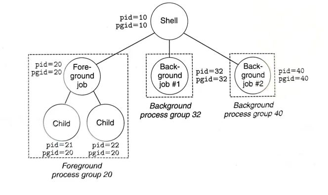

# Shell Lab 记录

<p style="text-align:right;">by TomatoEater<br>2021年11月</p>

> IT SUCKS. MINE EVEN SUCKS MORE.

## 1. 介绍

本次实验要求实现一个简单的shell。

该实验在`tsh.c`文件中实现了大部分的框架，需要自己完成以下函数内容：

- `eval`：解析和解释命令行的主例程，大约70行。

- `builtin_cmd`：识别并解释内置命令：`quit`、`fg`、`bg`和`job`，大约25行。

- - `quit`：退出当前shell
  - `fg <job>`：通过发送`SIGCONT`信号来重启`<job>`，并在前台运行。其中`<job>`可以是作业也可以是进程，`%1`表示作业号为`1`的作业，`1`表示进程号为`1`的进程。
  - `bg <job>`：通过发送`SIGCONT`信号来重启`<job>`，并在后台运行。
  - `job`：列出所有后台作业。

- `waitfg`：等待前台作业完成

- `sigchld_handler`：`SIGCHLD`信号的处理函数

- `sigint_handler`：`SIGINT`信号的处理函数

- `sigtstp_handler`：`SIGTSTP`信号的处理函数

我们希望实现的shell具有以下功能：

- 提示应为字符串`tsh>`
- 用户键入的命令行应包含一个名称和零个或多个参数，所有参数均由一个或多个空格分隔。 如果名称是内置命令，则shell应该立即处理它并等待下一个命令行。 否则，shell应该假定名称是可执行文件的路径，它在初始子进程的上下文中加载并运行。
- shell不需要支持管道`|`或I/O重定向`<`和`>`
- 键入`ctrl-c`（`ctrl-z`）应该会导致`SIGINT`（`SIGTSTP`）信号发送到当前前台作业以及该作业的任何子进程。
- 如果命令行以`＆`结束，则shell应该在后台运行作业，否则它将在前台运行该作业。如果没有前台作业，那么信号应该没有效果。
- 每个作业都可以通过进程ID（PID）或作业ID（JID）进行标识，该ID是tsh分配的正整数。
- shell需要支持以下内置命令：`quit`、`jobs`、`bg <job>`和`fg <job>`。
- shell应该回收所有僵死子进程，如果任何作业由于接收到未捕获的信号而终止，则shell应该识别此事件并打印一条消息，其中包含该作业的PID和有问题的信号的描述。（捕获catch信号：执行信号处理程序；接收receive信号：之后可以忽视ignore、终止terminate或者捕获catch）

通过`make`来得到我们shell的可执行目标文件，然后这里给出了一系列的验证文件，比如`trace01.txt`，其中包含了一些命令，我们可以通过`make test01`来得到我们shell的输出结果，可以和`make rtest01`输出的结果对比，或`tshref.out`比较，判断我们shell是否正确。

以上内容摘自[知乎](https://zhuanlan.zhihu.com/p/119034923)。其实就是handout的翻译。

***


## 2. 实现

### 2.0 总体思路



以上图为例说明。当我们`./tsh`后，就建立了图中shell进程。当输入内建命令，就直接在shell进程中运行，不用fork子进程。当然实际的shell运行内建命令并不一定是这么简单的。如果输入的不是内建命令的话，不妨假设是个前台工作。我们就fork一个进程（`Foreground job`），并且把这个子进程的pgid设置为pid（这里是20），最后再execve它。注意到，fork出的子进程默认pgid和父进程一致，所以之前pgid=10。于是该子进程之后fork出来的子进程child就会和`foreground job`有一致的pgid了。这样的设计为了给工作中所有进程发送信号变得可行。

```c
struct job_t {              /* The job struct */
    pid_t pid;              /* job PID */
    int jid;                /* job ID [1, 2, ...] */
    int state;              /* UNDEF, BG, FG, or ST */
    char cmdline[MAXLINE];  /* command line */
};
struct job_t jobs[MAXJOBS]; /* The job list */
```

我们通过维护`jobs`该全局变量来实现`job`、`jg`以及`bg`命令。对于前台工作，shell进程会挂起并等待它的完成，否则不会挂起。`job`命令只需访问jobs数组并输出即可；`jg`发送`SIGCONT`信号给一个后台工作来继续它的执行（之前可能被stop了），并修改其在jobs的state，同时把shell进程挂起来等待它完成；`bg`就发送`SIGCONT`信号即可。

而访问jobs这个全局变量，就会产生竞态。我们在shell进程中add job，并在`sigchld_handler`中`delete job`，可能会产生子进程已经结束并发送`sigchld`信号给父进程了，父进程还没有`add job`的情况出现。这便需要我们在shell进程中阻塞信号来确保add在delete之后。此外，任何访问全局变量的`critical section`都要阻塞所有信号，这是因为父进程在读写全局变量的时候，如果突然被信号打断，而信号处理函数也要读写全局变量，这样就会导致奇怪的错误。

信号处理函数是个相当棘手的问题。那`SIGCHLD`信号来说吧。子进程的终止属于异步事件，父进程无法预知子进程何时终止。父进程可以调用不带`WNOHANG`标志的`wait()`或者`waitpid()`挂起父进程来回收子进程；也可以周期性调用带有`WNOHANG`标志的`waitpid()`来对已经终止的子进程轮询。而前者无法实现后台工作，后者浪费了CPU资源。于是我们采取了为`SIGCHLD`函数建立信号处理程序`sigchld_handler`。利用`while(waitpid(-1,NULL,WNOHANG) > 0)`来回收子进程。

大致想法如上。

### 2.1 eval & builtin_cmd

```c
/* 
 * eval - Evaluate the command line that the user has just typed in
 * 
 * If the user has requested a built-in command (quit, jobs, bg or fg)
 * then execute it immediately. Otherwise, fork a child process and
 * run the job in the context of the child. If the job is running in
 * the foreground, wait for it to terminate and then return.  Note:
 * each child process must have a unique process group ID so that our
 * background children don't receive SIGINT (SIGTSTP) from the kernel
 * when we type ctrl-c (ctrl-z) at the keyboard.  
*/
void eval(char *cmdline) 
{
    char *argv[MAXARGS];
    int isBG = parseline(cmdline, argv); //build argv

    // 处理输入！
    /**
     * 输入为内建命令，直接运行，实际的shell可以在后台运行内建命令
     * 虽然可能如同jobs wulala这种错误输入，但是这里按tshref实现
     */ 
    const char *command = argv[0];
    if (command == NULL) //输入为空
        return;
    else if(!strcmp(command,"quit")) //recall：相等时strcmp返回0
        exit(0);
    //如果输入第一个字符为&，跳过该命令（按tshref实现）
    else if(!strcmp(command,"&"))
        return;
    else if(!strcmp(command,"bg")||!strcmp(command,"fg"))
        do_bgfg(argv);
    else if(!strcmp(command,"jobs"))
        listjobs(jobs);
    /**
     * 输入不是内建命令，要fork后exec
     */ 
    else
    {
        sigset_t mask_all, mask_one, prev; //创建信号集，来作为掩码
        sigfillset(&mask_all); //初始化set为全集，两种初始化手段之一
        sigemptyset(&mask_one); //初始化set为空集合，两种初始化手段之一
        sigaddset(&mask_one, SIGCHLD); //SIGCHILD加入mask_one集合
        /**
         * block SIGCHILD! 
         * 我们在sigchld_handler中remove了job，在父进程add了job
         * 为了使先父进程add job后再有remove job
         * 需要在fork前block SIGCHILD，在父进程add job后再unblock SIGCHILD
         */ 
        //block SIGCHILD, mask_one is stored in prev (for later recovery)
        sigprocmask(SIG_BLOCK, &mask_one, &prev);
        pid_t pid = fork();
        /**
         * 这里就举个处理系统调用函数的返回值的例子吧
         * 按理说sigprocmask、exit、wait等系统调用函数的返回值都要处理
         * handout说不处理要扣5分。。。
         * 可以用csapp提供的包装函数，但是不想修改了（就是把系统调用函数的首字母大写
         */ 
        if (pid < 0) 
            unix_error("fork error");
        /**
         * 子进程！
         */ 
        else if (pid == 0)
        {
            //子进程继承了父进程的阻塞向量，需要解除阻塞
            //避免收不到它本身的子进程的信号
            sigprocmask(SIG_SETMASK, &prev, NULL);
            /**
             * shell进程fork出来的子进程是自己进程组的领导，否则无前后台之说
             * 默认子进程的pgid就是父进程的pid，所以这里需要修改
             * setpgid(pid,pgid): 把pid的pgid设置为函数调用者的pgid
             * 如果pid为0，则pid使用调用者的pid；
             * 如果pgid为0，则pid的pgid会设置为pid
             */ 
            setpgid(0,0);
            //正常运行execve函数会替换内存，不会返回到调用者进程
            //但是有错误的话，会返回-1
            if (execve(argv[0], argv, environ) < 0)
            {
                printf("%s: Command not found\n", argv[0]);
                exit(0);
            }
        }
        /**
         * 父进程！
         */ 
        else
        {
            //访问全局变量阻塞所有信号
            sigprocmask(SIG_BLOCK, &mask_all, NULL);
            if(isBG) 
                addjob(jobs, pid, BG, cmdline);
            else
                addjob(jobs, pid, FG, cmdline);
            
            //addjob完成后就可以unblock SIGCHLD了
            sigprocmask(SIG_SETMASK, &prev, NULL);
            if(isBG)
                printf("[%d] (%d) %s",pid2jid(pid), pid, cmdline);
            else
                waitfg(pid); //等待前台作业完成
        }
    }
    return;
}
```

我将builtin_cmd函数放在了eval函数里面，可能是当初瞎写留下来的痕迹吧。

这里再强调一下如何保证add job在delete job之前执行吧。我们在fork前就阻塞了`SIGCHLD`信号，这样父进程在访问addjob前是接收不到`SIGCHLD`信号的。这样便不会执行`SIGCHLD`的处理程序，就能保证add在delete之前。

注意到我们在`addjob(jobs, pid, BG, cmdline);`前阻塞了所有信号，是为了全局变量的修改不被信号打断。

`setpgid(0,0);`把子进程的gpid设置为自己的pid。

此外，handout指出不对系统调用函数的返回值进行处理的话，要扣style分数5分。我几乎都没有处理，这里给个例子：

```c
void unix_error(char *msg) /* Unix-style error */
{
    fprintf(stderr, "%s: %s\n", msg, strerror(errno));
    exit(0);
}
pid_t Fork(void) 
{
    pid_t pid;
    if ((pid = fork()) < 0)
	unix_error("Fork error");
    return pid;
}
void Execve(const char *filename, char *const argv[], char *const envp[]) 
{
    if (execve(filename, argv, envp) < 0)
	unix_error("Execve error");
}
```

一般就是看返回值是不是-1，如果是的话，这些系统调用函数还会修改`errno`这个全局变量，我们可以通过`strerror(errno)`查看具体的错误类型。

### 2.2 do_bgfg

```c
/* 
 * do_bgfg - Execute the builtin bg and fg commands
 * bg/fg jobs 给jobs发送SIGCONT信号，并分别在后台和前台运行
 * jobs既可以是PID，也可以是JID，JID前面要加上%
 * 按参考tshref，我们也不检查bg 1 wulala这种错误的输入
 */
void do_bgfg(char **argv) 
{
    if (argv[1] == NULL)
    {
        printf("%s command requires PID or %%jobid argument\n", argv[0]);
        return;
    }

    struct job_t *job;
    int id;

    // 读到jid
    if (sscanf(argv[1], "%%%d", &id) > 0)
    {
        job = getjobjid(jobs, id);
        if (job == NULL)
        {
            printf("%%%d: No such job\n", id);
            return;
        }
    }
    // 读到pid
    else if (sscanf(argv[1], "%d", &id) > 0)
    {
        job = getjobpid(jobs, id);
        if (job == NULL)
        {
            printf("(%d): No such process\n", id);
            return;
        }
    }
    // 格式错误
    else
    {
        printf("%s: argument must be a PID or %%jobid\n", argv[0]);
        return;
    }
    /**
     * kill应该发送到job中的所有进程
     * 所以传入参数是pgid
     * 而eval函数保证了job中的pid就是pgid
     */ 
    if (!strcmp(argv[0], "bg"))
    {
        //进程组是pgid的相反数
        kill(-(job->pid), SIGCONT);
        job->state = BG;
        printf("[%d] (%d) %s", job->jid, job->pid, job->cmdline);
    }
    else
    {
        kill(-(job->pid), SIGCONT);
        job->state = FG;
        waitfg(job->pid); //等待前台作业完成
    }

    return;
}
```

这个难度尚可，就是学习一下kill函数的用法。而之前我们把`Foreground job`和`Background job`的`pgid`和`pid`设置为一样，在这里便体现了其作用。

按理说这里读写job也应该阻塞信号，但是我没有写。。。

### 2.3 waitfg

```c
/* 
 * waitfg - Block until process pid is no longer the foreground process
 */
/*高效并正确(?)的版本*/
void waitfg(pid_t pid)
{
    sigset_t mask, prev;
    sigemptyset(&mask);
    sigaddset(&mask, SIGCHLD);
    sigprocmask(SIG_BLOCK, &mask, &prev);
    /**
     * int sigsuspend(const sigset_t *mask)相当于
     * sigprocmask(SIG_SETMASK, &mask, &prev)
     * pause()
     * sigprocmask(SIG_SETMASK, &prev, NULL)
     * 的原子版本
     */ 
    while (pid == fgpid(jobs))
        sigsuspend(&prev);
    sigprocmask(SIG_SETMASK, &prev, NULL);
}
/*忙等是可行的，但是效率差
void waitfg(pid_t pid)
{
	while (pid == fgpid(jobs))
		sleep(1);
    return;
} 
*/
/*我不认为以下是可行的。
void waitfg(pid_t pid)
{
    sigset_t m;
    sigemptyset(&m);
    while (pid == fgpid(jobs))
    当此时传入sigchild信号，并接下来无任何信号传入，会永远pause
        sigsuspend(&m);//这和pause()不就是一样了吗
    return;
}
*/
```

waitfg函数网上看来看去就两种写法，我觉得很不对呀。忙等有效率差的问题，而用sigsuspend函数的则写错了，会产生竞态。我的版本测试下来应该没有问题。

我们的waitfg函数是没有回收子进程的，在handout有这句话：

> While other solutions are possible, such as calling waitpid in both waitfg and sigchld handler, these can be very confusing.

便从了。

### 2.4 sigint_handler & sigtstp_handler

这两个代码应该一致的吧。

```c
/* 
 * sigint_handler - The kernel sends a SIGINT to the shell whenver the
 *    user types ctrl-c at the keyboard.  Catch it and send it along
 *    to the foreground job.  
 */
void sigint_handler(int sig) 
{
    int olderrno = errno;
    sigset_t mask_all, prev;
    sigfillset(&mask_all);
    sigprocmask(SIG_BLOCK, &mask_all, &prev);
    pid_t fpid = fgpid(jobs);
    if(fpid)
        kill(-fpid, sig);
    sigprocmask(SIG_SETMASK, &prev, NULL);
    errno = olderrno;
}

/*
 * sigtstp_handler - The kernel sends a SIGTSTP to the shell whenever
 *     the user types ctrl-z at the keyboard. Catch it and suspend the
 *     foreground job by sending it a SIGTSTP.  
 */
void sigtstp_handler(int sig) 
{
    int olderrno = errno;
    sigset_t mask_all, prev;
    sigfillset(&mask_all);
    sigprocmask(SIG_BLOCK, &mask_all, &prev);
    pid_t fpid = fgpid(jobs);
    if(fpid)
        kill(-fpid, sig);
    sigprocmask(SIG_SETMASK, &prev, NULL);
    errno = olderrno;
}
```

再强调几点：

- `Foreground job`和`Background job`的`pgid`和`pid`设置为一样，使得`kill`函数简单可行
- `errno`是全局变量，为了避免修改而使得shell进程中的`strerror(errno)`输出错误，我们存入了`olderror`这个局部变量里。
- 要访问全局变量，还是阻塞所有信号吧。信号处理程序也可以被其他信号打断。

### 2.5 sigchld_handler

```c
void sigchld_handler(int sig) 
{
    int olderrno = errno;
    pid_t pid;
    int status;
    sigset_t mask_all, prev;
    sigfillset(&mask_all);
    /**
     * pid_t waitpid(pid_t __pid, int *__stat_loc, int __options)的options：
     * WNOHANG：若等待集合中没有子进程被终止，父进程不会被挂起，而是waitpid函数返回0
     * WUNTRACED：除了返回终止子进程的信息外，还返回因信号而停止的子进程信息
     * WNOHANG|WUNTRACED：如果等待集合无子进程终止或者停止，立刻返回0，否则返回该终止或停止的子进程的pid
    */
    while ((pid = waitpid(-1,&status,WNOHANG|WUNTRACED)) > 0)
    {
        sigprocmask(SIG_BLOCK, &mask_all, &prev);
        if(WIFEXITED(status))//return true if the child terminated normally, via a call to exit or a return
        {
            deletejob(jobs,pid);
        }
        if(WIFSTOPPED(status))//return true if the child that caused the return is currently stopped
        {
            struct job_t *job = getjobpid(jobs, pid); //Find a job (by PID) on the job list
            int jid = pid2jid(pid); //Map process ID to job ID
            printf("Job [%d] (%d) stopped by signal %d\n",jid,pid,WSTOPSIG(status));
            job->state = ST;
        }
        if(WIFSIGNALED(status))//return true if the child process terminated because of a signal that was not caught
        {
            int jid = pid2jid(pid);
            printf("Job [%d] (%d) terminated by signal %d\n",jid,pid,WTERMSIG(status));
            deletejob(jobs,pid);
        }
        sigprocmask(SIG_SETMASK, &prev, NULL);
    }
    /*这个判断有错，因为可能还有子进程，error不为ECHILD。这里不需要回收所有的子进程，只需要回收所有的僵尸进程。
    if (errno != ECHILD)
        Sio_error("waitpid error");
    */
    errno = olderrno;
}
```

这个就很有难度了。首先，由于信号不存在队列，所以一个未处理信号表明至少有一个信号到达，于是我们需要使用`while`循环，而不能用`if`。此外，对于接收到SIGSTP和SIGINT信号的我们需要分别处理。还需要注意访问全局变量时阻塞信号、WNOHANG|WUNTRACED的使用。等等不一而足。

最后强调一点，关于异步信号安全。我们知道信号处理程序和调用进程是并发执行的，不同于不同进程是有独立的地址空间。于是信号处理程序会和调用进程产生竞争。比如说`printf`函数，如果我们同时用在了信号处理程序和调用进程中，我们不能保证printf的输出是正确的。一个异步信号安全的函数要么是可重入的（reentrant，只用了局部变量），要么不会被信号处理程序所中断。下面是Linux保证的一些异步信号安全的函数：

| accept        | fchmod      | lseek             | sendto      | stat             |
| ------------- | ----------- | ----------------- | ----------- | ---------------- |
| access        | fchown      | lstat             | setgid      | symlink          |
| aio_error     | fcntl       | mkdir             | setpgid     | sysconf          |
| aio_return    | fdatasync   | mkfifo            | setsid      | tcdrain          |
| aio_suspend   | fork        | open              | setsockopt  | tcflow           |
| alarm         | fpathconf   | pathconf          | setuid      | tcflush          |
| bind          | fstat       | pause             | shutdown    | tcgetattr        |
| cfgetispeed   | fsync       | pipe              | sigaction   | tcgetpgrp        |
| cfgetospeed   | ftruncate   | poll              | sigaddset   | tcsendbreak      |
| cfsetispeed   | getegid     | posix_trace_event | sigdelset   | tcsetattr        |
| cfsetospeed   | geteuid     | pselect           | sigemptyset | tcsetpgrp        |
| chdir         | getgid      | raise             | sigfillset  | time             |
| chmod         | getgroups   | read              | sigismenber | timer_getoverrun |
| chown         | getpeername | readlink          | signal      | timer_gettime    |
| clock_gettime | getpgrp     | recv              | sigpause    | timer_settime    |
| close         | getpid      | recvfrom          | sigpending  | times            |
| connect       | getppid     | recvmsg           | sigprocmask | umask            |
| creat         | getsockname | rename            | sigqueue    | uname            |
| dup           | getsockopt  | rmdir             | sigset      | unlink           |
| dup2          | getuid      | select            | sigsuspend  | utime            |
| execle        | kill        | sem_post          | sleep       | wait             |
| execve        | link        | send              | socket      | waitpid          |
| _Exit & _exit | listen      | sendmsg           | socketpair  | write            |

***


## 3. 写在后面

本人于2021年11月7日完成了shell lab，耗时三天。总体来说我觉得shell lab相当不错！你可以说它不难，代码量就充其量两百行，但是对于初学者的我们来说，中间的思维量还是相当大的。阻塞信号、信号处理程序、系统调用函数等等要点都在这个tiny shell中得到了体现。这也算是我第一次写了一些linux系统编程吧，感觉挺有趣的。

通过这个lab，几乎就是重读了书上的第八章（除了非本地跳转部分）。对整个异常控制流的理解早已超过当初第一遍读这一章的时候了。当然对于信号和进程的linux系统编程还有很多可以学习的地方。

在我做shell lab的时候参考了THE LINUX PROGRAMMING INTERFACE这本书的一些内容。个人觉得这本书应该相当不错的，除了看目录难以找到我想要的函数外。当然只查阅了几页，不能妄下结论。

可能接下来：

- malloc lab？
- 吃番茄买的鱼籽村！！！！！！！！！！！！！！！！！！！！！！！！！！！！！！！！！！！！！！！！！！！！！！！！！！！！！！！！！！

>  P.S. I've learnt ps though I don't have PS.
